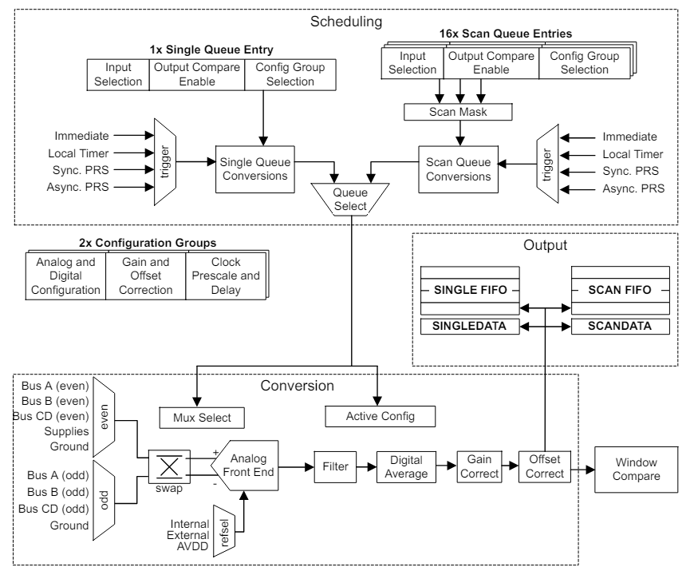
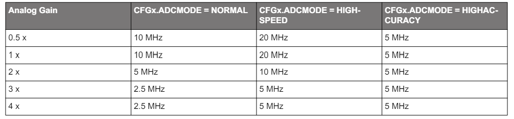
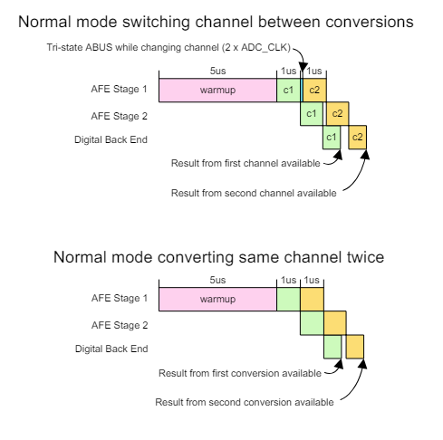
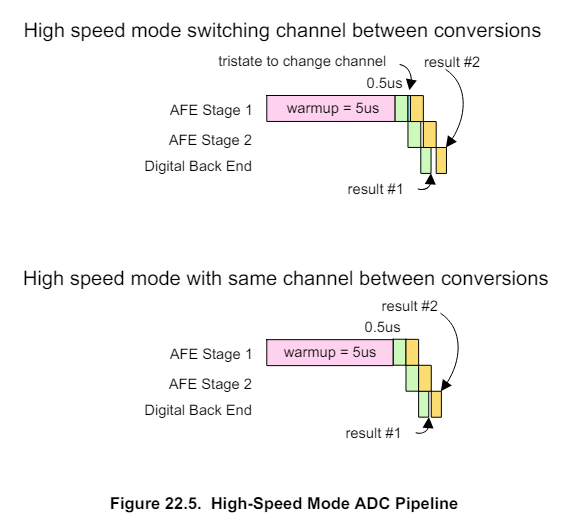
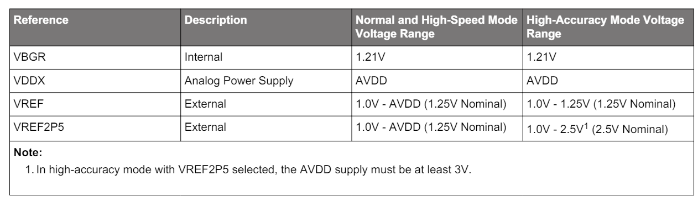
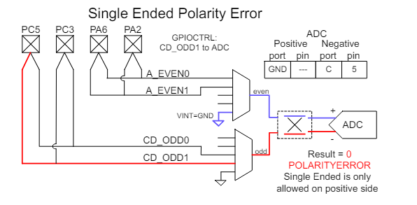
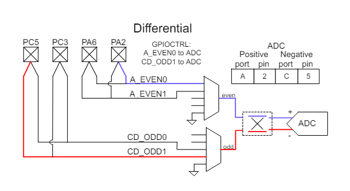
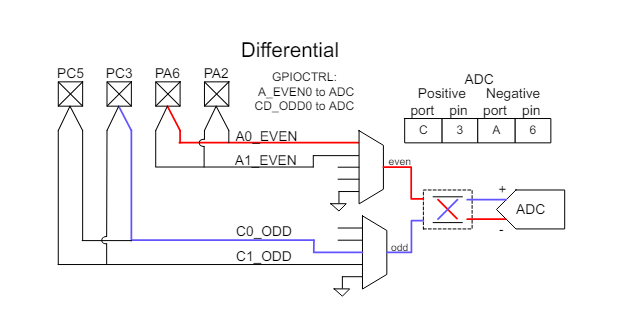

# IADC : Incremental Analog to Digital Converter

Quoi ?

L'IADC est utilisé pour convertir les tensions analogiques en représentation numérique et offre un fonctionnement à grande vitesse et à faible consommation.

Pourquoi ?

Dans de nombreuses applications, il est nécessaire de mesurer des signaux analogiques et de les enregistrer sous forme numérique, sans épuiser la source d'énergie.

Comment ?

L'IADC basse consommation échantillonne une ou plusieurs entrées canaux dans une séquence programmable. Avec l'aide de PRS et DMA, l'IADC peut fonctionner sans intervention du processeur dans EM2 et EM3, minimisant ainsi le nombre de ressources sous tension. Le IADC peut être automatiquement arrêté entre les conversions vers réduire encore la consommation d’énergie.

## Introduction

L'IADC utilise une architecture d'approximation successive incrémentielle, avec une résolution allant jusqu'à 12 bits lorsqu'il fonctionne à deux millions d'échantillons par seconde (2 Msps). L'architecture incrémentale flexible utilise le suréchantillonnage pour permettre aux applications d'échanger de la vitesse contre des performances plus élevées.
Un mode haute précision permet une résolution supérieure à 15 bits sans bruit. Un multiplexeur d'entrée intégré peut sélectionner parmi des E/S externes et plusieurs signaux internes.

## Description fonctionnelle

### Accès aux registres

De nombreux registres de configuration du module IADC ne peuvent être écrits que lorsque le module est désactivé (`IADC_EN_EN` = 0). Ceux-ci sont
`IADC_CTRL`, `IADC_TIMER`, `IADC_CMPTHR`, `IADC_TRIGGER`, `IADC_CFGx`, `IADC_SCALEx`, `IADC_SCHEDx` et `IADC_SCANx`. UN
La séquence de configuration typique du module IADC est :
- Avec l'IADC désactivé (`IADC_EN_EN` = 0), programmez tous les registres de configuration répertoriés ci-dessus.
- Activez l'IADC en définissant EN dans `IADC_EN` sur 1.
- Programmez les registres de configuration restants.
- Activez la file d'attente unique ou d'analyse.
- Le IADC est prêt à être utilisé.

### Clocking

La logique IADC est divisée en deux domaines d'horloge : `CLK_BUS` (APBIF) et `CLK_SRC_ADC` (CORE). Le domaine APBIF contient les registres IADC et la logique de lecture FIFO. Le reste de l'IADC est cadencé principalement par `CLK_SRC_ADC` et `ADC_CLK`, tous deux dérivés de `CLK_CMU_ADC`, comme indiqué dans .

`CLK_CMU_ADC` est l'horloge entrante acheminée vers l'ADC par la CMU et peut atteindre 80 MHz. Il est sélectionné au sein du module CMU. Si l'ADC doit être utilisé de manière synchrone avec un module TIMER externe, l'horloge doit être configurée pour dériver de l'horloge du groupe A. En cas de configuration pour un fonctionnement dans EM2 ou EM3, une source d'horloge disponible dans EM2 et EM3 doit être utilisée directement, car le multiplexeur d'horloge du groupe A sera arrêté dans EM2 et EM3.

`CLK_SRC_ADC` est dérivé de CLK_CMU_ADC et ne doit pas être plus rapide que 40 MHz. Le champ HSCLKRATE dans `IADC_CTRL` définit le pré-scaler pour diviser `CLK_CMU_ADC`. Si `CLK_CMU_ADC` est déjà à 40 MHz ou moins, HSCLKRATE peut être défini sur 0x0 pour transmettre l'horloge à `CLK_SRC_ADC` sans la diviser. `CLK_SRC_ADC` est la source d'horloge utilisée pour le préscaler TIMEBASE ainsi que pour le temporisateur IADC local.

`ADC_CLK` est utilisé pour piloter la logique frontale et la machine d'état de l'ADC. Un autre pré-échelonneur est utilisé pour réduire `CLK_SRC_ADC` à une fréquence appropriée pour le mode de fonctionnement ADC. Différents modes opérationnels ont des restrictions différentes sur la vitesse d'horloge de l'IADC. Étant donné que le mode de fonctionnement peut être différent pour les conversions simples ou par analyse, ou même pour différentes conversions au sein d'une analyse, chaque groupe de configuration possède un champ de bits PRESCALE dans le registre IADC_SCHEDx.

Lorsque `IADC_CFGx.ADCMODE` est défini sur `NORMAL`, PRESCALE doit être défini pour limiter `ADC_CLK` à une vitesse ne dépassant pas 10 MHz pour les paramètres de gain analogique 0,5x et 1x. Pour un gain analogique de 2x, 3x et 4x, l'ADC_CLK maximum est respectivement de 5 MHz, 2,5 MHz ou 2,5 MHz.

Lorsque `IADC_CFGx.ADCMODE` est défini sur HIGHSPEED, tout depuis le mode NORMAL est mis à l'échelle par un facteur de 2. PRESCALE doit être défini pour limiter `ADC_CLK` à une vitesse maximale de 20 MHz pour les paramètres de gain analogique 0,5x et 1x. Pour un gain analogique de 2x, 3x et 4x, l'`ADC_CLK` maximum est respectivement de 10 MHz, 5 MHz ou 5 MHz. Il est recommandé d'exécuter `ADC_CLK` à une vitesse ne dépassant pas 100 kHz.

Lorsque `IADC_CFGx.ADCMODE` est défini sur HIGHACCURACY, PRESCALE doit être défini pour limiter `ADC_CLK` à une vitesse maximale de 5 MHz, quel que soit le paramètre de gain analogique.

Ces restrictions sont résumées dans le Tableau 22.1 Vitesse maximale `ADC_CLK` par rapport au gain analogique et paramètres `ADCMODE` à la page 712.

Remarque : Si HSCLKRATE est configuré pour diviser CLK_CMU_ADC par plus de 1 (HSCLKRATE != 0), alors PRESCALE ne doit pas être défini pour diviser par 1 (PRESCALE = 0). Lorsque cette condition est détectée, une valeur PRESCALE de 1 (divisée par 2) sera automatiquement utilisée à la place de la valeur PRESCALE programmée.

Les champs du mode suspension IADC_CTRL_ADCCLKSUSPEND0 (pour les conversions par analyse) ou IADC_CTRL_ADCCLKSUSPEND1 (pour les conversions uniques) peuvent être utilisés pour arrêter l'horloge entre les conversions et économiser de l'énergie. La logique ADC réveillera l'horloge avant de démarrer le préchauffage IADC et d'effectuer une conversion. Si le mode suspension est défini, l'horloge s'éteindra à nouveau une fois la conversion terminée.

Lorsque IADC_TRIGGER_SCANTRIGSEL ou IADC_TRIGGER_SINGLETRIGSEL est défini sur IMMEDIATE, IADC_CTRL_ADCCLKSUSPENDn forcera l'horloge à fonctionner uniquement lorsque l'une des files d'attente est activée.

### Timing de convertion

L'IADC prend plusieurs échantillons du signal analogique pour produire chaque sortie. Le nombre d'échantillons d'entrée contribuant à un mot de sortie est déterminé par le taux de suréchantillonnage (OSR). Des paramètres OSR plus élevés amélioreront les INL et DNL de l'ADC et réduiront le bruit au niveau du système, mais nécessiteront plus de temps pour chaque conversion. Différents OSR peuvent être spécifiés pour chaque groupe de configuration. Il est important de noter que le suréchantillonnage est un processus analogique qui fournit davantage d'échantillons d'entrée au filtre numérique. Pour les modes Normal et Haute vitesse, l'OSR est configuré avec le champ binaire OSRHS dans le registre IADC_CFGx. Les options OSR pour le mode haute précision sont différentes et sont configurées avec le champ de bits OSRHA dans le registre IADC_CFGx.

Lors d'une conversion, la fréquence d'échantillonnage frontale effective (Fsample) en modes Normal et Haute vitesse est égale à ADC_CLK/4. En mode Haute précision, Fsample est ADC_CLK/5.

### Warmup Time

Pour économiser de l'énergie, l'IADC peut être configuré pour s'éteindre complètement ou entrer en état de veille entre les conversions, si un fonctionnement à pleine vitesse n'est pas requis pour l'application. Le temps de préchauffage requis de l'ADC à partir d'un état complètement hors tension est de 5 us. L'échauffement à partir d'un état de veille nécessite 1 us. Le préchauffage est automatiquement chronométré par la logique ADC lorsqu'il est requis, mais le logiciel doit configurer le champ TIMEBASE dans IADC_CTRL pour un intervalle minimum de 1 us. Notez que le compteur TIMEBASE reçoit CLK_SRC_ADC et doit être programmé en fonction de cette fréquence. Par exemple, si CLK_SRC_ADC est de 40 MHz, TIMEBASE doit être défini sur au moins 0x27 (39) pour produire l'intervalle minimum de 1 us. Lors de la transition depuis un état hors tension, l'IADC utilisera cinq intervalles TIMEBASE. Lorsqu'il est en veille, l'IADC utilisera un intervalle TIMEBASE.

Le champ WARMUPMODE du registre IADC_CTRL définit si l'IADC est mis hors tension entre les conversions (WARMUPMODE = NORMAL), en veille entre les conversions (WARMUPMODE = KEEPINSTANDBY) ou reste sous tension (WARMUPMODE = KEEPWARM). L'heure de démarrage résultante est indiquée dans la Figure 22.3 Synchronisation de démarrage à la page 714. Notez que même dans WARMUPMODE = KEEPWARM ou KEEPINSTANDBY, l'ADC mettra en œuvre 5 intervalles TIMEBASE de préchauffage lors de la mise sous tension initiale, ou tout changement de configuration affectant PRESCALE, ADCMODE. , ou REFSEL. IADC_STATUS_ADCWARM reflète l’état de préchauffage actuel de l’IADC.

### Pipeline de conversion en modes normal et haute vitesse

L'IADC utilise une architecture pipeline pour effectuer différentes étapes de la conversion ADC en parallèle.

En modes Normal et Haute vitesse, le temps de conversion pour un seul échantillon peut être déterminé à partir de l'OSR et de la fréquence ADC_CLK pré-mise à l'échelle (fADC_CLK) comme :

Temps de conversion = ((4 * OSR) + 2) / fADC_CLK

L'OSR minimum est de 2, ce qui signifie que la conversion la plus rapide possible dure 10 cycles d'horloge ADC_CLK.

En mode Normal ou Haute Vitesse, l'IADC insère automatiquement 2 cycles supplémentaires dans le pipeline lors du changement de canal vers une nouvelle entrée. Cela permet de maintenir la synchronisation sur la conversion précédente et de laisser le temps de trier les bus analogiques ABUS avant de connecter l'entrée suivante au bus analogique. Par conséquent, le taux d'échantillonnage maximal lors d'un échantillonnage continu sur un canal en mode Normal (avec ADC_CLK = 10 MHz) est de 1 Msps, et le taux d'échantillonnage maximal lors du changement de canal est de 833 ksps.

En mode haute vitesse, la vitesse ADC_CLK autorisée est doublée pour atteindre 20 MHz. Le taux d'échantillonnage maximal lors de la conversion continue d'un seul canal est de 2 Msps, et le taux d'échantillonnage maximal lors du changement de canal est de 1,67 Msps.

La Figure 22.4 Pipeline ADC en mode normal à la page 715 et la Figure 22.5 Pipeline ADC en mode haute vitesse à la page 716 illustrent des scénarios à canal unique et à commutation de canal lors de la mise sous tension à partir d'un état d'arrêt avec WARMUPMODE = NORMAL. L'échauffement de 5 us est affiché en rose, un premier pipeline de conversion en vert et une deuxième conversion en orange.
La zone bleue dans le diagramme du haut représente le temps supplémentaire nécessaire pour tri-état lors du changement de chaîne.

### Planification et déclencheurs

L'IADC dispose de plusieurs options de déclenchement disponibles pour la file d'attente unique et la file d'attente d'analyse. Lorsqu'un déclencheur de conversion se produit et qu'aucune autre conversion n'est active ou en attente, la demande est traitée immédiatement. Si les files d'attente unique et d'analyse sont utilisées dans une application, il est possible de répondre aux demandes de conversion selon les besoins et de spécifier leur priorité.
Le déclenchement de la conversion est configuré à l'aide de champs de bits dans le registre IADC_TRIGGER. Les champs SINGLETRIGSEL et SCANTRIGSEL spécifient respectivement la source de déclenchement pour la conversion Single et Scan. Les options pour la source de déclenchement sont :
- IMMÉDIAT - Déclenchement depuis le logiciel. Ceci est utile pour déclencher des conversions à la demande à partir d'un logiciel sans échantillonnage spécifique.
exigences de fréquence ou lancer des conversions continues à pleine vitesse.
- TIMER - Utilisez la minuterie locale de l'IADC pour déclencher des conversions. Ceci est utile pour déclencher des conversions à intervalles précis.
- PRSCLKGRP - Utilisez un canal PRS synchrone pour déclencher à partir d'un périphérique externe dans le même domaine de groupe d'horloge (c'est-à-dire horloge
groupe A). Ceci est utile pour synchroniser les conversions avec précision avec des événements TIMER externes ou des sorties PWM.

Remarque : Il est recommandé de configurer les registres des consommateurs PRS avant d'activer les déclencheurs PRS synchrones afin d'éviter les faux déclencheurs.

- PRSPOS - Utilisez un front positif d'un canal PRS asynchrone pour déclencher des conversions. La source de déclenchement nécessitera 1-2
Cycles CLK_SRC_ADC à synchroniser. Ceci est utile pour déclencher des conversions selon les besoins à partir de sources périphériques asynchrones.
tels que les entrées GPIO, les événements SYSRTC, etc.
- PRSNEG - Utilisez un front négatif d'un canal PRS asynchrone pour déclencher des conversions. C'est la même chose que PRSPOS, mais fonctionne sur les fronts négatifs de l'entrée sélectionnée.
- LESENSE (SCAN uniquement) - Utilisez la signalisation du périphérique LESENSE pour déclencher les conversions. Lors de l'utilisation de ce mode, une seule entrée
dans la table SCAN (spécifiée par le canal LESENSE) est converti par demande de conversion, et la file d'attente SCAN n'est pas disponible pour
fonctionnement normal.

Les sources de déclenchement uniques et par analyse peuvent être configurées pour générer une requête par déclencheur ou commencer des conversions continues. Le réglage de SINGLETRIGACTION sur ONCE effectuera une demande de conversion à chaque fois que le déclencheur unique sélectionné se produit, et un seul ADC
la sortie sera convertie. Le réglage de SINGLETRIGACTION sur CONTINUOUS permet au déclencheur unique de commencer la première conversion, et
lorsqu'une conversion est terminée, une nouvelle sera demandée immédiatement sans nécessiter de nouveau déclencheur. Les sélections et la configuration des canaux ne doivent pas être modifiées lorsque SINGLETRIGACTION est réglé sur CONTINUOUS. Cela peut produire des erreurs de conversion. L'analyse
la file d'attente doit être utilisée si un changement de canal ou de configuration est requis.

Le champ SCANTRIGACTION fonctionne pour demander des analyses de conversion de la même manière. Régler SCANTRIGACTION sur ONCE fera en sorte que
une requête à chaque fois que le déclencheur d'analyse sélectionné se produit, et l'IADC effectuera toutes les conversions spécifiées dans l'analyse une fois auparavant
arrêt. Le réglage de SCANTRIGACTION sur CONTINUOUS permet au déclencheur d'analyse de lancer des analyses continues. Lorsqu'un cycle d'analyse est terminé, un nouveau sera immédiatement demandé sans nécessiter un nouveau déclenchement.

La priorité de conversion peut être ajustée à l'aide du bit SINGLETAILGATE. Par défaut, SINGLETAILGATE est défini sur TAILGATEOFF, ce qui signifie
que les déclencheurs de conversion sont mis en file d'attente dans l'ordre dans lequel ils sont reçus. Tout déclencheur de conversion pour la file d'attente unique ou la file d'attente d'analyse sera
lancer une conversion dès que possible. Si une conversion est déjà en cours ou en attente, la nouvelle conversion sera traitée après
l'opération en cours.

La définition de SINGLETAILGATE sur TAILGATEON donne la priorité ultime à la file d'attente d'analyse. L'IADC n'effectuera que des conversions uniques
immédiatement après la fin d'une analyse. Cela permet aux systèmes d'utiliser la file d'attente d'analyse pour les conversions hautement prioritaires avec des exigences de timing strictes, et la file d'attente unique pour les événements de conversion à la demande de faible priorité. Notez que ce paramètre ne doit être utilisé que lorsque le déclenchement des conversions de numérisation est garanti. Si aucune séquence d'analyse n'est déclenchée, tout déclencheur de conversion unique restera en attente indéfiniment. Il est également important de noter que s'il n'y a pas suffisamment de temps entre les conversions par numérisation pour effectuer une seule conversion, la conversion par numérisation suivante sera retardée.

### Sélection de référence et gain analogique

La référence IADC par défaut consiste à utiliser le circuit de bande interdite interne. La tension d'alimentation analogique peut également être utilisée comme référence de tension. La tension de référence est sélectionnée à l'aide du champ REFSEL dans IADC_CFGx.

L'IADC dispose également d'une sélection de gain analogique, contrôlée via le champ ANALOGGAIN dans IADC_CFGx. Le gain analogique peut être réglé sur 0,5x, 1x, 2x, 3x ou 4x. Notez que les modes de gain 2x, 3x et 4x peuvent nécessiter un ADC_CLK plus lent. Le gain analogique a un impact sur l'endroit où se produit la lecture d'entrée à pleine échelle. Par exemple, avec une référence externe de 1,25 V et ANALOGGAIN réglé sur 2x, l'entrée analogique de l'IADC est multipliée par un facteur de 2 et une lecture à pleine échelle se produit à 1,25 V / 2 = 0,625 V. Si ANALOGGAIN est réglé sur 0,5x, la lecture à pleine échelle de l'ADC n'aura pas lieu tant que l'entrée n'atteindra pas 2,5 V. Notez que l'ADC n'est capable de mesurer que les entrées dans les rails d'alimentation de l'appareil. Si la pleine échelle est configurée pour être supérieure à la tension d'alimentation, l'entrée maximale sera limitée à l'alimentation.

La capacité d'échantillonnage (Csample) est modifiée en fonction du réglage du gain analogique.

Compte tenu de la capacité d'échantillonnage et du taux d'échantillonnage frontal
 (Fsample), l'impédance d'entrée du convertisseur peut être calculée comme suit : Zin = 1 / (Csample * Fsample)
Notez que l'entrée n'est pas échantillonnée lorsque le convertisseur est inactif entre les conversions et que le fonctionnement avec WARMUPMODE = NORMAL ou KEEPINSTANDBY avec des intervalles plus longs entre les déclencheurs de conversion peut augmenter l'impédance d'entrée effective du convertisseur.

### Sélection d'entrée et de configuration

L'IADC prend en charge la mesure d'un certain nombre de signaux internes et externes. Les signaux externes sont acheminés vers GPIO via des ressources ABUS partagées sur l'appareil ou (sur certains appareils) via des entrées analogiques dédiées disponibles pour le bloc IADC.

La file d'attente unique et la file d'attente d'analyse disposent de registres séparés disponibles pour sélectionner les entrées et les configurations. Le registre IADC_SINGLE est utilisé pour sélectionner l'entrée et la configuration de la file d'attente unique. Les registres IADC_SCANx sont utilisés pour sélectionner les entrées et les configurations pour chacune des entrées de la table d'analyse. Dans les deux cas, le contenu et la configuration du registre sont similaires. Les champs PORTPOS et PINPOS sont utilisés pour sélectionner un signal pour l'entrée ADC positive, tandis que PORTNEG et PINNEG sont utilisés pour sélectionner un signal pour l'entrée ADC négative. Le champ CFG sélectionne lequel des deux jeux de configuration sera utilisé avec l'entrée (c'est-à-dire les options de configuration spécifiées dans IADC_CFGx, IADC_SCALEx et IADC_SCHEDx).

Pour effectuer des conversions asymétriques, le champ PORTNEG doit être défini sur GND. Cela indique que l'entrée positive de l'ADC sera mesurée en référence à la masse de la puce. PORTPOS et PINPOS doivent être utilisés pour sélectionner le signal d’entrée souhaité. Le champ PINNEG n'est pas utilisé pour les conversions asymétriques.

Pour effectuer des conversions différentielles, PORTPOS, PINPOS sont utilisés pour sélectionner l'entrée positive de l'ADC, tandis que PORTNEG et PINNEG sont utilisés pour sélectionner l'entrée négative. Notez qu'il existe deux multiplexeurs indépendants dans l'ADC et que le micrologiciel ne peut pas sélectionner deux signaux du même multiplexeur pour une mesure différentielle. Le multiplexeur « pair » comprend toutes les sélections EVEN ABUS, les options de tension d'alimentation et GND. Le multiplexeur "impair" comprend toutes les sélections ODD ABUS et GND. Une sélection de chaque multiplexeur est autorisée sur l'entrée positive et négative. Des exemples plus détaillés peuvent être trouvés dans 22.3.5.3 Exemples de sélection d'entrée ABUS.

La file d'attente d'analyse comporte un registre supplémentaire, IADC_MASKREQ, pour spécifier lequel des 16 emplacements de canal possibles sera converti lors d'une opération d'analyse. Chaque canal de la file d'attente d'analyse est activé en écrivant le bit correspondant dans le registre IADC_MASKREQ à 1.
Les canaux activés seront convertis dans l'ordre du plus bas au plus élevé, lors d'un balayage. Voir 22.3.5.4 File d'attente de numérisation pour plus de détails sur l'utilisation de la file d'attente de numérisation.

#### Entrées GPIO externes

Les sélections d'entrée GPIO sont acheminées via des ressources ABUS partagées. Pour que l'IADC puisse utiliser n'importe quel GPIO comme entrée, l'IADC doit se voir attribuer des ressources de bus analogique appropriées dans les registres GPIO_ABUSALLOC, GPIO_BBUSALLOC ou GPIO_CDBUSALLOC. Par exemple, si IADC0 utilise à la fois des broches paires et impaires sur le port GPIO PA, alors AEVEN0 et AODD0 dans GPIO_ABUSALLOC pourraient tous deux être définis sur IADC0. Cela donne à IADC0 l’accès à ces deux bus. Généralement, l'accès au bus est défini sur des périphériques spécifiques au moment de la configuration et laissé seul - il n'est normalement pas nécessaire de modifier l'allocation du bus à la volée. Si l'IADC demande une broche à un bus qui n'a pas été alloué à l'IADC, une erreur sera générée, le PORTALLOCERRIF dans IADC_IF sera défini et tout résultat de conversion sera 0. Pour plus de détails sur la structure et les capacités du bus analogique, reportez-vous à la section GPIO.

Lorsque les bus analogiques appropriés ont été configurés pour être acheminés vers l'IADC, la sélection GPIO consiste simplement à programmer le port et la broche souhaités dans les champs PORTPOS, PINPOS, PORTNEG et PINNEG. Par exemple, pour configurer un canal pour convertir la tension différentielle entre les broches PA5 et PA4, PORTPOS = PORTA, PINPOS = 5, PORTNEG = PORTA, PINNEG = 4. Si une sélection invalide est effectuée, une erreur de polarité sera générée. Des exemples plus spécifiques sont décrits dans 22.3.5.3 Exemples de sélection d'entrée ABUS.

#### Entrées internes et dédiées

Les signaux internes et les entrées dédiées ne sont pas acheminés via les ressources ABUS partagées. En général, ces ressources sont sélectionnées directement par les paramètres de PORTPOS et PORTNEG, tandis que les champs PINPOS et PINNEG ne sont pas utilisés. Lorsque PORTPOS est réglé sur SUPPLY, PINPOS est utilisé pour sélectionner laquelle des alimentations est connectée. Pour faciliter les mesures d'alimentation à l'aide d'options de référence internes, les alimentations à tension plus élevée sont atténuées d'un facteur 4.

Si un signal interne est sélectionné pour PORTPOS ou PORTNEG, la sélection de GND sur l'entrée opposée demandera au convertisseur d'effectuer une conversion asymétrique. Dans le cas où PORTPOS = GND, la logique IADC permutera automatiquement l'entrée directe sélectionnée par PORTNEG vers l'entrée positive de l'ADC. Sinon, une conversion différentielle est effectuée avec PORTPOS sélectionnant l'entrée positive et PORTNEG sélectionnant l'entrée négative.

#### Exemples de sélection d'entrée ABUS

Lors de la configuration pour mesurer un signal asymétrique via l'ABUS, la sélection d'entrée positive doit toujours pointer vers l'entrée souhaitée et PORTNEG doit être programmé sur GND. Des exemples de configuration correcte pour les conversions asymétriques sont présentés dans la Figure 22.12 Canal impair de sélection de port/broche asymétrique à la page 725 et la Figure 22.13 Canal pair de sélection de port/broche asymétrique à la page 725. Notez que la logique IADC permutera automatiquement les multiplexeur approprié
à l’entrée positive de l’ADC.

La figure 22.14 Erreur de polarité de sélection de port/broche asymétrique à la page 726 montre un exemple dans lequel l'entrée PORTPOS a été configurée sur GND, avec PORTNEG et PINNEG configurés pour une broche GPIO. Cela entraînera une erreur de polarité (POLARITYERRIF dans IADC_IF sera défini) et tout résultat de conversion sera 0.

Des exemples de configuration correcte pour les conversions différentielles sont présentés dans la Figure 22.15 Sélection de port/broche différentielle sans échange à la page 726 et dans la Figure 22.16 Sélection de port/broche différentielle avec échange à la page 727. Dans ces deux exemples, les entrées ont été sélectionnées à partir d'un canal de multiplexeur PAIR et un canal de multiplexeur ODD. Comme pour le mode asymétrique, la logique IADC permutera automatiquement les connexions du multiplexeur vers l'entrée IADC si nécessaire.

La figure 22.17 Erreur de polarité de sélection de port/broche différentiel à la page 727 montre un exemple dans lequel les sélections d'entrée positive et négative pointent vers des bus ODD. Même si les deux bus ont été attribués à l'IADC, ils transitent tous deux par le multiplexeur d'entrée ODD et ne peuvent pas être mesurés l'un par rapport à l'autre. Cela entraînera une erreur de polarité (POLARITYERRIF dans IADC_IF sera défini) et tout résultat de conversion sera 0x7FFFF. De même, une erreur de polarité se produira si les deux entrées sont sélectionnées sur les bus PAIR

