# IADC : Incremental Analog to Digital Converter

Quoi ?

L'IADC est utilisé pour convertir les tensions analogiques en représentation numérique et offre un fonctionnement à grande vitesse et à faible consommation.

Pourquoi ?

Dans de nombreuses applications, il est nécessaire de mesurer des signaux analogiques et de les enregistrer sous forme numérique, sans épuiser la source d'énergie.

Comment ?

L'IADC basse consommation échantillonne une ou plusieurs entrées canaux dans une séquence programmable. Avec l'aide de PRS et DMA, l'IADC peut fonctionner sans intervention du processeur dans EM2 et EM3, minimisant ainsi le nombre de ressources sous tension. Le IADC peut être automatiquement arrêté entre les conversions vers réduire encore la consommation d’énergie.

## Introduction

L'IADC utilise une architecture d'approximation successive incrémentielle, avec une résolution allant jusqu'à 12 bits lorsqu'il fonctionne à deux millions d'échantillons par seconde (2 Msps). L'architecture incrémentale flexible utilise le suréchantillonnage pour permettre aux applications d'échanger de la vitesse contre des performances plus élevées.
Un mode haute précision permet une résolution supérieure à 15 bits sans bruit. Un multiplexeur d'entrée intégré peut sélectionner parmi des E/S externes et plusieurs signaux internes.

## Description fonctionnelle

### Accès aux registres

De nombreux registres de configuration du module IADC ne peuvent être écrits que lorsque le module est désactivé (`IADC_EN_EN` = 0). Ceux-ci sont
`IADC_CTRL`, `IADC_TIMER`, `IADC_CMPTHR`, `IADC_TRIGGER`, `IADC_CFGx`, `IADC_SCALEx`, `IADC_SCHEDx` et `IADC_SCANx`. UN
La séquence de configuration typique du module IADC est :
- Avec l'IADC désactivé (`IADC_EN_EN` = 0), programmez tous les registres de configuration répertoriés ci-dessus.
- Activez l'IADC en définissant EN dans `IADC_EN` sur 1.
- Programmez les registres de configuration restants.
- Activez la file d'attente unique ou d'analyse.
- Le IADC est prêt à être utilisé.

### Clocking

La logique IADC est divisée en deux domaines d'horloge : `CLK_BUS` (APBIF) et `CLK_SRC_ADC` (CORE). Le domaine APBIF contient les registres IADC et la logique de lecture FIFO. Le reste de l'IADC est cadencé principalement par `CLK_SRC_ADC` et `ADC_CLK`, tous deux dérivés de `CLK_CMU_ADC`, comme indiqué dans .

`CLK_CMU_ADC` est l'horloge entrante acheminée vers l'ADC par la CMU et peut atteindre 80 MHz. Il est sélectionné au sein du module CMU. Si l'ADC doit être utilisé de manière synchrone avec un module TIMER externe, l'horloge doit être configurée pour dériver de l'horloge du groupe A. En cas de configuration pour un fonctionnement dans EM2 ou EM3, une source d'horloge disponible dans EM2 et EM3 doit être utilisée directement, car le multiplexeur d'horloge du groupe A sera arrêté dans EM2 et EM3.

`CLK_SRC_ADC` est dérivé de CLK_CMU_ADC et ne doit pas être plus rapide que 40 MHz. Le champ HSCLKRATE dans `IADC_CTRL` définit le pré-scaler pour diviser `CLK_CMU_ADC`. Si `CLK_CMU_ADC` est déjà à 40 MHz ou moins, HSCLKRATE peut être défini sur 0x0 pour transmettre l'horloge à `CLK_SRC_ADC` sans la diviser. `CLK_SRC_ADC` est la source d'horloge utilisée pour le préscaler TIMEBASE ainsi que pour le temporisateur IADC local.

`ADC_CLK` est utilisé pour piloter la logique frontale et la machine d'état de l'ADC. Un autre pré-échelonneur est utilisé pour réduire `CLK_SRC_ADC` à une fréquence appropriée pour le mode de fonctionnement ADC. Différents modes opérationnels ont des restrictions différentes sur la vitesse d'horloge de l'IADC. Étant donné que le mode de fonctionnement peut être différent pour les conversions simples ou par analyse, ou même pour différentes conversions au sein d'une analyse, chaque groupe de configuration possède un champ de bits PRESCALE dans le registre IADC_SCHEDx.

Lorsque `IADC_CFGx.ADCMODE` est défini sur `NORMAL`, PRESCALE doit être défini pour limiter `ADC_CLK` à une vitesse ne dépassant pas 10 MHz pour les paramètres de gain analogique 0,5x et 1x. Pour un gain analogique de 2x, 3x et 4x, l'ADC_CLK maximum est respectivement de 5 MHz, 2,5 MHz ou 2,5 MHz.

Lorsque `IADC_CFGx.ADCMODE` est défini sur HIGHSPEED, tout depuis le mode NORMAL est mis à l'échelle par un facteur de 2. PRESCALE doit être défini pour limiter `ADC_CLK` à une vitesse maximale de 20 MHz pour les paramètres de gain analogique 0,5x et 1x. Pour un gain analogique de 2x, 3x et 4x, l'`ADC_CLK` maximum est respectivement de 10 MHz, 5 MHz ou 5 MHz. Il est recommandé d'exécuter `ADC_CLK` à une vitesse ne dépassant pas 100 kHz.

Lorsque `IADC_CFGx.ADCMODE` est défini sur HIGHACCURACY, PRESCALE doit être défini pour limiter `ADC_CLK` à une vitesse maximale de 5 MHz, quel que soit le paramètre de gain analogique.

Ces restrictions sont résumées dans le Tableau 22.1 Vitesse maximale `ADC_CLK` par rapport au gain analogique et paramètres `ADCMODE` à la page 712.

Remarque : Si HSCLKRATE est configuré pour diviser CLK_CMU_ADC par plus de 1 (HSCLKRATE != 0), alors PRESCALE ne doit pas être défini pour diviser par 1 (PRESCALE = 0). Lorsque cette condition est détectée, une valeur PRESCALE de 1 (divisée par 2) sera automatiquement utilisée à la place de la valeur PRESCALE programmée.

Les champs du mode suspension IADC_CTRL_ADCCLKSUSPEND0 (pour les conversions par analyse) ou IADC_CTRL_ADCCLKSUSPEND1 (pour les conversions uniques) peuvent être utilisés pour arrêter l'horloge entre les conversions et économiser de l'énergie. La logique ADC réveillera l'horloge avant de démarrer le préchauffage IADC et d'effectuer une conversion. Si le mode suspension est défini, l'horloge s'éteindra à nouveau une fois la conversion terminée.

Lorsque IADC_TRIGGER_SCANTRIGSEL ou IADC_TRIGGER_SINGLETRIGSEL est défini sur IMMEDIATE, IADC_CTRL_ADCCLKSUSPENDn forcera l'horloge à fonctionner uniquement lorsque l'une des files d'attente est activée.

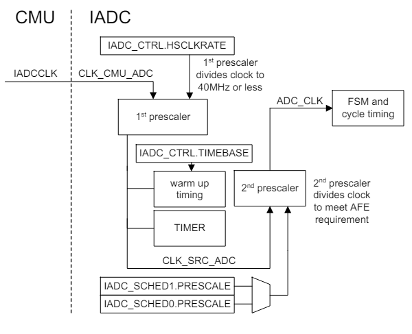

### Timing de convertion

L'IADC prend plusieurs échantillons du signal analogique pour produire chaque sortie. Le nombre d'échantillons d'entrée contribuant à un mot de sortie est déterminé par le taux de suréchantillonnage (OSR). Des paramètres OSR plus élevés amélioreront les INL et DNL de l'ADC et réduiront le bruit au niveau du système, mais nécessiteront plus de temps pour chaque conversion. Différents OSR peuvent être spécifiés pour chaque groupe de configuration. Il est important de noter que le suréchantillonnage est un processus analogique qui fournit davantage d'échantillons d'entrée au filtre numérique. Pour les modes Normal et Haute vitesse, l'OSR est configuré avec le champ binaire OSRHS dans le registre IADC_CFGx. Les options OSR pour le mode haute précision sont différentes et sont configurées avec le champ de bits OSRHA dans le registre IADC_CFGx.

Lors d'une conversion, la fréquence d'échantillonnage frontale effective (Fsample) en modes Normal et Haute vitesse est égale à ADC_CLK/4. En mode Haute précision, Fsample est ADC_CLK/5.

### Warmup Time

Pour économiser de l'énergie, l'IADC peut être configuré pour s'éteindre complètement ou entrer en état de veille entre les conversions, si un fonctionnement à pleine vitesse n'est pas requis pour l'application. Le temps de préchauffage requis de l'ADC à partir d'un état complètement hors tension est de 5 us. L'échauffement à partir d'un état de veille nécessite 1 us. Le préchauffage est automatiquement chronométré par la logique ADC lorsqu'il est requis, mais le logiciel doit configurer le champ TIMEBASE dans IADC_CTRL pour un intervalle minimum de 1 us. Notez que le compteur TIMEBASE reçoit CLK_SRC_ADC et doit être programmé en fonction de cette fréquence. Par exemple, si CLK_SRC_ADC est de 40 MHz, TIMEBASE doit être défini sur au moins 0x27 (39) pour produire l'intervalle minimum de 1 us. Lors de la transition depuis un état hors tension, l'IADC utilisera cinq intervalles TIMEBASE. Lorsqu'il est en veille, l'IADC utilisera un intervalle TIMEBASE.

Le champ WARMUPMODE du registre IADC_CTRL définit si l'IADC est mis hors tension entre les conversions (WARMUPMODE = NORMAL), en veille entre les conversions (WARMUPMODE = KEEPINSTANDBY) ou reste sous tension (WARMUPMODE = KEEPWARM). L'heure de démarrage résultante est indiquée dans la Figure 22.3 Synchronisation de démarrage à la page 714. Notez que même dans WARMUPMODE = KEEPWARM ou KEEPINSTANDBY, l'ADC mettra en œuvre 5 intervalles TIMEBASE de préchauffage lors de la mise sous tension initiale, ou tout changement de configuration affectant PRESCALE, ADCMODE. , ou REFSEL. IADC_STATUS_ADCWARM reflète l’état de préchauffage actuel de l’IADC.

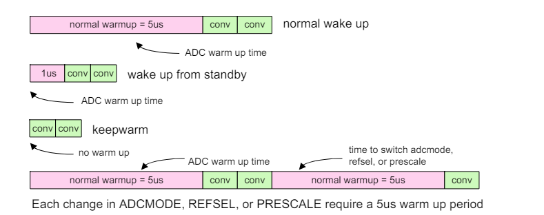

### Pipeline de conversion en modes normal et haute vitesse

L'IADC utilise une architecture pipeline pour effectuer différentes étapes de la conversion ADC en parallèle.

En modes Normal et Haute vitesse, le temps de conversion pour un seul échantillon peut être déterminé à partir de l'OSR et de la fréquence ADC_CLK pré-mise à l'échelle (fADC_CLK) comme :

Temps de conversion = ((4 * OSR) + 2) / fADC_CLK

L'OSR minimum est de 2, ce qui signifie que la conversion la plus rapide possible dure 10 cycles d'horloge ADC_CLK.

En mode Normal ou Haute Vitesse, l'IADC insère automatiquement 2 cycles supplémentaires dans le pipeline lors du changement de canal vers une nouvelle entrée. Cela permet de maintenir la synchronisation sur la conversion précédente et de laisser le temps de trier les bus analogiques ABUS avant de connecter l'entrée suivante au bus analogique. Par conséquent, le taux d'échantillonnage maximal lors d'un échantillonnage continu sur un canal en mode Normal (avec ADC_CLK = 10 MHz) est de 1 Msps, et le taux d'échantillonnage maximal lors du changement de canal est de 833 ksps.

En mode haute vitesse, la vitesse ADC_CLK autorisée est doublée pour atteindre 20 MHz. Le taux d'échantillonnage maximal lors de la conversion continue d'un seul canal est de 2 Msps, et le taux d'échantillonnage maximal lors du changement de canal est de 1,67 Msps.

La Figure 22.4 Pipeline ADC en mode normal à la page 715 et la Figure 22.5 Pipeline ADC en mode haute vitesse à la page 716 illustrent des scénarios à canal unique et à commutation de canal lors de la mise sous tension à partir d'un état d'arrêt avec WARMUPMODE = NORMAL. L'échauffement de 5 us est affiché en rose, un premier pipeline de conversion en vert et une deuxième conversion en orange.
La zone bleue dans le diagramme du haut représente le temps supplémentaire nécessaire pour tri-état lors du changement de chaîne.

### Planification et déclencheurs

L'IADC dispose de plusieurs options de déclenchement disponibles pour la file d'attente unique et la file d'attente d'analyse. Lorsqu'un déclencheur de conversion se produit et qu'aucune autre conversion n'est active ou en attente, la demande est traitée immédiatement. Si les files d'attente unique et d'analyse sont utilisées dans une application, il est possible de répondre aux demandes de conversion selon les besoins et de spécifier leur priorité.
Le déclenchement de la conversion est configuré à l'aide de champs de bits dans le registre `IADC_TRIGGER`. Les champs `SINGLETRIGSEL` et `SCANTRIGSEL` spécifient respectivement la source de déclenchement pour la conversion Single et Scan. Les options pour la source de déclenchement sont :
- IMMÉDIAT - Déclenchement depuis le logiciel. Ceci est utile pour déclencher des conversions à la demande à partir d'un logiciel sans échantillonnage spécifique.
exigences de fréquence ou lancer des conversions continues à pleine vitesse.
- TIMER - Utilisez la minuterie locale de l'IADC pour déclencher des conversions. Ceci est utile pour déclencher des conversions à intervalles précis.
- PRSCLKGRP - Utilisez un canal PRS synchrone pour déclencher à partir d'un périphérique externe dans le même domaine de groupe d'horloge (c'est-à-dire horloge
groupe A). Ceci est utile pour synchroniser les conversions avec précision avec des événements TIMER externes ou des sorties PWM.

Remarque : Il est recommandé de configurer les registres des consommateurs PRS avant d'activer les déclencheurs PRS synchrones afin d'éviter les faux déclencheurs.

- PRSPOS - Utilisez un front positif d'un canal PRS asynchrone pour déclencher des conversions. La source de déclenchement nécessitera 1-2
Cycles CLK_SRC_ADC à synchroniser. Ceci est utile pour déclencher des conversions selon les besoins à partir de sources périphériques asynchrones.
tels que les entrées GPIO, les événements SYSRTC, etc.
- PRSNEG - Utilisez un front négatif d'un canal PRS asynchrone pour déclencher des conversions. C'est la même chose que PRSPOS, mais fonctionne sur les fronts négatifs de l'entrée sélectionnée.
- LESENSE (SCAN uniquement) - Utilisez la signalisation du périphérique LESENSE pour déclencher les conversions. Lors de l'utilisation de ce mode, une seule entrée
dans la table SCAN (spécifiée par le canal LESENSE) est converti par demande de conversion, et la file d'attente SCAN n'est pas disponible pour
fonctionnement normal.

Les sources de déclenchement uniques et par analyse peuvent être configurées pour générer une requête par déclencheur ou commencer des conversions continues. Le réglage de `SINGLETRIGACTION` sur `ONCE` effectuera une demande de conversion à chaque fois que le déclencheur unique sélectionné se produit, et un seul ADC la sortie sera convertie. Le réglage de `SINGLETRIGACTION` sur `CONTINUOUS` permet au déclencheur unique de commencer la première conversion, et
lorsqu'une conversion est terminée, une nouvelle sera demandée immédiatement sans nécessiter de nouveau déclencheur. Les sélections et la configuration des canaux ne doivent pas être modifiées lorsque `SINGLETRIGACTION` est réglé sur `CONTINUOUS`. Cela peut produire des erreurs de conversion. L'analyse
la file d'attente doit être utilisée si un changement de canal ou de configuration est requis.

Le champ `SCANTRIGACTION` fonctionne pour demander des analyses de conversion de la même manière. Régler `SCANTRIGACTION` sur `ONCE` fera en sorte que
une requête à chaque fois que le déclencheur d'analyse sélectionné se produit, et l'IADC effectuera toutes les conversions spécifiées dans l'analyse une fois auparavant arrêt. Le réglage de `SCANTRIGACTION` sur `CONTINUOUS` permet au déclencheur d'analyser et de lancer des analyses continues. Lorsqu'un cycle d'analyse est terminé, un nouveau sera immédiatement demandé sans nécessiter un nouveau déclenchement.

La priorité de conversion peut être ajustée à l'aide du bit `SINGLETAILGATE`. Par défaut, `SINGLETAILGATE` est défini sur `TAILGATEOFF`, ce qui signifie
que les déclencheurs de conversion sont mis en file d'attente dans l'ordre dans lequel ils sont reçus. Tout déclencheur de conversion pour la file d'attente unique ou la file d'attente de scan sera de lancer une conversion dès que possible. Si une conversion est déjà en cours ou en attente, la nouvelle conversion sera traitée après l'opération en cours.

La définition de `SINGLETAILGATE` sur `TAILGATEON` donne la priorité ultime à la file d'attente de scan. L'IADC n'effectuera que des conversions uniques
immédiatement après la fin d'une analyse. Cela permet aux systèmes d'utiliser la file d'attente de scan pour les conversions hautement prioritaires avec des exigences de timing strictes, et la file d'attente unique pour les événements de conversion à la demande de faible priorité. Notez que ce paramètre ne doit être utilisé que lorsque le déclenchement des conversions de numérisation est garanti. Si aucune séquence de scan n'est déclenchée, tout déclencheur de conversion unique restera en attente indéfiniment. Il est également important de noter que s'il n'y a pas suffisamment de temps entre les conversions par numérisation pour effectuer une seule conversion, la conversion par numérisation suivante sera retardée.

#### Exemples de déclenchement de conversion

##### Planification d'un seul échantillon

Le cas d'utilisation le plus simple de l'IADC consiste à effectuer une conversion à la demande à partir de la file d'attente unique. La figure 22.7 Conversion unique immédiate à la page 718 montre la configuration et le timing de ce cas d’utilisation. Le mode de préchauffage IADC est configuré pour normal (s'arrête entre les conversions). Le déclencheur de file d'attente unique est configuré pour le déclenchement immédiat d'une conversion et le talonnage est désactivé. Lorsque la conversion est demandée (en définissant IADC_CMD_SINGLESTART), le bloc IADC se réchauffe puis commence la conversion. Pendant la conversion, le bit CONVERTING dans IADC_STATUS est activé. Une fois la conversion terminée, la file d'attente est désactivée et SINGLEQEN renvoie un niveau bas.

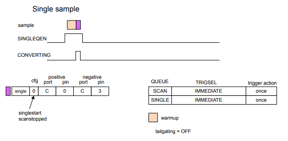

##### Analyses périodiques

Un autre cas d'utilisation courant consiste à déclencher périodiquement l'IADC pour qu'il effectue une analyse multicanal.
analyse. La figure 22.8 Exemple d'analyse périodique à la page 719 montre la synchronisation d'une analyse périodique déclenchée par le temporisateur local de l'IADC. Le scanner est configuré pour échantillonner quatre canaux différents ; deux utilisant la configuration 0 et deux utilisant la configuration 1. Notez qu'un seul déclencheur TIMER est utilisé pour lancer chaque analyse et que les quatre échantillons sont prélevés pour chaque déclencheur. Notez également que l'IADC insère un autre temps de préchauffage entre les conversions 1 et 2, lorsqu'il passe de la configuration 0 à la configuration 1. La file d'attente unique est désactivée et n'est pas utilisée dans cet exemple.

##### Exemples de talonnage

Un exemple utilisant le talonnage de conversion est présenté dans la Figure 22.9 Conversion simple avec le talonnage activé à la page 720. 

Dans l'exemple, la file d'attente scan est configurée pour déclencher périodiquement une conversion à deux canaux sur le temporisateur local IADC, tandis que la file d'attente unique est configurée pour se déclencher sur  demande du logiciel. Lorsqu'une seule conversion est demandée, il attend la fin de la séquence d'analyse, puis la conversion unique est effectuée. Les conversions d'analyse utilisent la configuration 0 et la conversion unique utilise la configuration 1, donc un délai de préchauffage est inséré entre la fin de l'analyse et le début du cycle de conversion unique. Notez que cet exemple laisse suffisamment de temps entre les conversions d’analyse IADC pour qu’une seule conversion se produise, et qu’aucune conversion d’analyse n’est retardée.

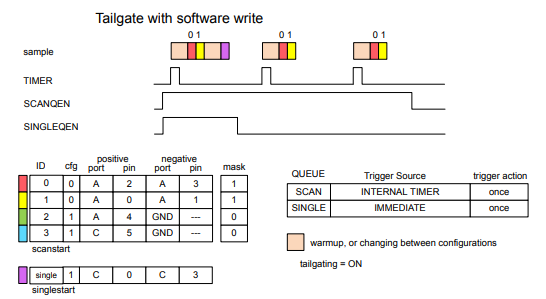

Un autre exemple, présenté dans la Figure 22.10 Conversions avec le talonnage désactivé à la page 721, montre comment les demandes sont traitées sur les différentes files d'attente de conversion avec le talonnage désactivé.

Dans cet exemple, la file d'attente de scrutation est déclenchée sur le TIMER interne tandis que la file d'attente unique est déclenchée sur un front positif PRS. Le talonnage n’étant pas activé, les files d’attente seront desservies selon le principe du premier arrivé, premier servi. Le premier déclencheur de file d'attente unique se situe entre deux déclencheurs de file d'attente d'analyse et n'interfère pas avec la synchronisation de la file d'attente d'analyse. Le deuxième déclenchement de file d'attente unique se produit juste avant le déclenchement de la file d'attente d'analyse. L'IADC terminera cette conversion de file d'attente unique et retardera les prochaines conversions de file d'attente d'analyse.

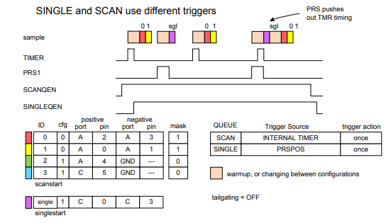

##### Conversions continues

Un exemple de conversions continues déclenchées à partir de la file d'attente d'analyse est présenté dans la Figure 22.11 Conversions continues à la page 721. Dans cet exemple, le champ SCANTRIGACTION dans IADC_TRIGGER est défini sur CONTINUOUS et la source du déclencheur de conversion est un logiciel (SCANTRIGSEL = IMMEDIATE). Lorsque la file d'attente d'analyse est activée avec IADC_CMD_SCANSTART, l'ADC se réchauffe puis effectue des analyses répétées consécutives jusqu'à ce que le logiciel désactive la file d'attente d'analyse à l'aide de IADC_CMD_SCANSTOP. Bien que cet exemple montre un seul canal converti en continu, il est possible d'activer plusieurs canaux pour la séquence de balayage.

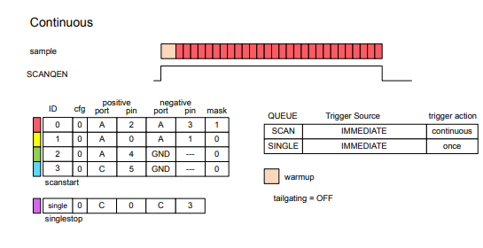

### Sélection de référence et gain analogique

La référence IADC par défaut consiste à utiliser le circuit de bande interdite interne. La tension d'alimentation analogique peut également être utilisée comme référence de tension. La tension de référence est sélectionnée à l'aide du champ REFSEL dans IADC_CFGx.

L'IADC dispose également d'une sélection de gain analogique, contrôlée via le champ ANALOGGAIN dans IADC_CFGx. Le gain analogique peut être réglé sur 0,5x, 1x, 2x, 3x ou 4x. Notez que les modes de gain 2x, 3x et 4x peuvent nécessiter un ADC_CLK plus lent. Le gain analogique a un impact sur l'endroit où se produit la lecture d'entrée à pleine échelle. Par exemple, avec une référence externe de 1,25 V et ANALOGGAIN réglé sur 2x, l'entrée analogique de l'IADC est multipliée par un facteur de 2 et une lecture à pleine échelle se produit à 1,25 V / 2 = 0,625 V. Si ANALOGGAIN est réglé sur 0,5x, la lecture à pleine échelle de l'ADC n'aura pas lieu tant que l'entrée n'atteindra pas 2,5 V. Notez que l'ADC n'est capable de mesurer que les entrées dans les rails d'alimentation de l'appareil. Si la pleine échelle est configurée pour être supérieure à la tension d'alimentation, l'entrée maximale sera limitée à l'alimentation.

La capacité d'échantillonnage (Csample) est modifiée en fonction du réglage du gain analogique.

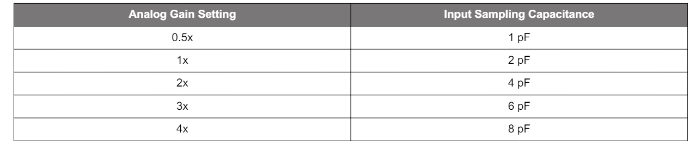

Compte tenu de la capacité d'échantillonnage et du taux d'échantillonnage frontal
 (Fsample), l'impédance d'entrée du convertisseur peut être calculée comme suit : Zin = 1 / (Csample * Fsample)
Notez que l'entrée n'est pas échantillonnée lorsque le convertisseur est inactif entre les conversions et que le fonctionnement avec WARMUPMODE = NORMAL ou KEEPINSTANDBY avec des intervalles plus longs entre les déclencheurs de conversion peut augmenter l'impédance d'entrée effective du convertisseur.

### Sélection d'entrée et de configuration

L'IADC prend en charge la mesure d'un certain nombre de signaux internes et externes. Les signaux externes sont acheminés vers GPIO via des ressources ABUS partagées sur l'appareil ou (sur certains appareils) via des entrées analogiques dédiées disponibles pour le bloc IADC.

La file d'attente unique et la file d'attente d'analyse disposent de registres séparés disponibles pour sélectionner les entrées et les configurations. Le registre IADC_SINGLE est utilisé pour sélectionner l'entrée et la configuration de la file d'attente unique. Les registres IADC_SCANx sont utilisés pour sélectionner les entrées et les configurations pour chacune des entrées de la table d'analyse. Dans les deux cas, le contenu et la configuration du registre sont similaires. Les champs PORTPOS et PINPOS sont utilisés pour sélectionner un signal pour l'entrée ADC positive, tandis que PORTNEG et PINNEG sont utilisés pour sélectionner un signal pour l'entrée ADC négative. Le champ CFG sélectionne lequel des deux jeux de configuration sera utilisé avec l'entrée (c'est-à-dire les options de configuration spécifiées dans IADC_CFGx, IADC_SCALEx et IADC_SCHEDx).

Pour effectuer des conversions asymétriques, le champ PORTNEG doit être défini sur GND. Cela indique que l'entrée positive de l'ADC sera mesurée en référence à la masse de la puce. PORTPOS et PINPOS doivent être utilisés pour sélectionner le signal d’entrée souhaité. Le champ PINNEG n'est pas utilisé pour les conversions asymétriques.

Pour effectuer des conversions différentielles, PORTPOS, PINPOS sont utilisés pour sélectionner l'entrée positive de l'ADC, tandis que PORTNEG et PINNEG sont utilisés pour sélectionner l'entrée négative. Notez qu'il existe deux multiplexeurs indépendants dans l'ADC et que le micrologiciel ne peut pas sélectionner deux signaux du même multiplexeur pour une mesure différentielle. Le multiplexeur « pair » comprend toutes les sélections EVEN ABUS, les options de tension d'alimentation et GND. Le multiplexeur "impair" comprend toutes les sélections ODD ABUS et GND. Une sélection de chaque multiplexeur est autorisée sur l'entrée positive et négative. Des exemples plus détaillés peuvent être trouvés dans 22.3.5.3 Exemples de sélection d'entrée ABUS.

La file d'attente d'analyse comporte un registre supplémentaire, IADC_MASKREQ, pour spécifier lequel des 16 emplacements de canal possibles sera converti lors d'une opération d'analyse. Chaque canal de la file d'attente d'analyse est activé en écrivant le bit correspondant dans le registre IADC_MASKREQ à 1.
Les canaux activés seront convertis dans l'ordre du plus bas au plus élevé, lors d'un balayage. Voir 22.3.5.4 File d'attente de numérisation pour plus de détails sur l'utilisation de la file d'attente de numérisation.

#### Entrées GPIO externes

Les sélections d'entrée GPIO sont acheminées via des ressources ABUS partagées. Pour que l'IADC puisse utiliser n'importe quel GPIO comme entrée, l'IADC doit se voir attribuer des ressources de bus analogique appropriées dans les registres GPIO_ABUSALLOC, GPIO_BBUSALLOC ou GPIO_CDBUSALLOC. Par exemple, si IADC0 utilise à la fois des broches paires et impaires sur le port GPIO PA, alors AEVEN0 et AODD0 dans GPIO_ABUSALLOC pourraient tous deux être définis sur IADC0. Cela donne à IADC0 l’accès à ces deux bus. Généralement, l'accès au bus est défini sur des périphériques spécifiques au moment de la configuration et laissé seul - il n'est normalement pas nécessaire de modifier l'allocation du bus à la volée. Si l'IADC demande une broche à un bus qui n'a pas été alloué à l'IADC, une erreur sera générée, le PORTALLOCERRIF dans IADC_IF sera défini et tout résultat de conversion sera 0. Pour plus de détails sur la structure et les capacités du bus analogique, reportez-vous à la section GPIO.

Lorsque les bus analogiques appropriés ont été configurés pour être acheminés vers l'IADC, la sélection GPIO consiste simplement à programmer le port et la broche souhaités dans les champs PORTPOS, PINPOS, PORTNEG et PINNEG. Par exemple, pour configurer un canal pour convertir la tension différentielle entre les broches PA5 et PA4, PORTPOS = PORTA, PINPOS = 5, PORTNEG = PORTA, PINNEG = 4. Si une sélection invalide est effectuée, une erreur de polarité sera générée. Des exemples plus spécifiques sont décrits dans 22.3.5.3 Exemples de sélection d'entrée ABUS.

#### Entrées internes et dédiées

Les signaux internes et les entrées dédiées ne sont pas acheminés via les ressources ABUS partagées. En général, ces ressources sont sélectionnées directement par les paramètres de PORTPOS et PORTNEG, tandis que les champs PINPOS et PINNEG ne sont pas utilisés. Lorsque PORTPOS est réglé sur SUPPLY, PINPOS est utilisé pour sélectionner laquelle des alimentations est connectée. Pour faciliter les mesures d'alimentation à l'aide d'options de référence internes, les alimentations à tension plus élevée sont atténuées d'un facteur 4.

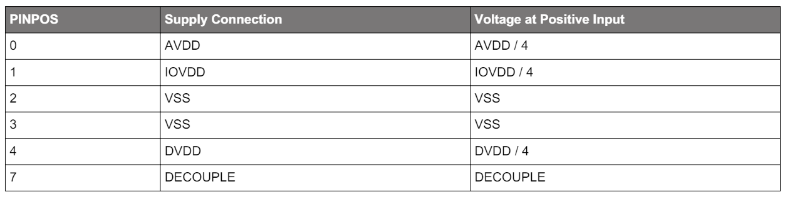

Si un signal interne est sélectionné pour PORTPOS ou PORTNEG, la sélection de GND sur l'entrée opposée demandera au convertisseur d'effectuer une conversion asymétrique. Dans le cas où PORTPOS = GND, la logique IADC permutera automatiquement l'entrée directe sélectionnée par PORTNEG vers l'entrée positive de l'ADC. Sinon, une conversion différentielle est effectuée avec PORTPOS sélectionnant l'entrée positive et PORTNEG sélectionnant l'entrée négative.

#### Exemples de sélection d'entrée ABUS

Lors de la configuration pour mesurer un signal asymétrique via l'ABUS, la sélection d'entrée positive doit toujours pointer vers l'entrée souhaitée et PORTNEG doit être programmé sur GND. Des exemples de configuration correcte pour les conversions asymétriques sont présentés dans la Figure 22.12 Canal impair de sélection de port/broche asymétrique à la page 725 et la Figure 22.13 Canal pair de sélection de port/broche asymétrique à la page 725. Notez que la logique IADC permutera automatiquement les multiplexeur approprié
à l’entrée positive de l’ADC.

La figure 22.14 Erreur de polarité de sélection de port/broche asymétrique à la page 726 montre un exemple dans lequel l'entrée PORTPOS a été configurée sur GND, avec PORTNEG et PINNEG configurés pour une broche GPIO. Cela entraînera une erreur de polarité (POLARITYERRIF dans IADC_IF sera défini) et tout résultat de conversion sera 0.

Des exemples de configuration correcte pour les conversions différentielles sont présentés dans la Figure 22.15 Sélection de port/broche différentielle sans échange à la page 726 et dans la Figure 22.16 Sélection de port/broche différentielle avec échange à la page 727. Dans ces deux exemples, les entrées ont été sélectionnées à partir d'un canal de multiplexeur PAIR et un canal de multiplexeur ODD. Comme pour le mode asymétrique, la logique IADC permutera automatiquement les connexions du multiplexeur vers l'entrée IADC si nécessaire.

La figure 22.17 Erreur de polarité de sélection de port/broche différentiel à la page 727 montre un exemple dans lequel les sélections d'entrée positive et négative pointent vers des bus ODD. Même si les deux bus ont été attribués à l'IADC, ils transitent tous deux par le multiplexeur d'entrée ODD et ne peuvent pas être mesurés l'un par rapport à l'autre. Cela entraînera une erreur de polarité (POLARITYERRIF dans IADC_IF sera défini) et tout résultat de conversion sera 0x7FFFF. De même, une erreur de polarité se produira si les deux entrées sont sélectionnées sur les bus PAIR

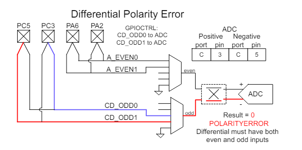

#### File d'attente d'analyse

La file d'attente de balayage permet à l'IADC de convertir automatiquement jusqu'à 16 canaux en séquence sans intervention du processeur. Sélection d'entrée et de configuration pour chaque canal dans le
La table d'analyse est spécifiée par le registre IADC_SCANx pour ce canal (le canal 0 est configuré avec IADC_SCAN0, le canal 1 est configuré avec IADC_SCAN1, et ainsi de suite). Le registre IADC_MASKREQ permet au logiciel de définir laquelle des entrées de la table d'analyse (IADC_SCANx) convertir lors d'une analyse. Par exemple, les canaux 0, 1 et 7 peuvent être activés en écrivant les bits 0, 1 et 7 de IADC_MASKREQ à 1 (IADC_MASKREQ = 0x0083).

Les registres IADC_SCANx doivent être configurés lorsque le module IADC est désactivé (IADC_EN_EN = 0). IADC_MASKREQ peut être écrit alors que IADC_EN_EN est défini sur 1. Si une opération d'analyse est en cours, MASKREQ sera synchronisé et conservé jusqu'à ce que l'opération d'analyse en cours soit terminée. Ensuite, MASKREQ est copié dans le registre STMASK pour la prochaine opération d'analyse. IADC_STMASK est la copie de travail du MASKREQ utilisée par l'IADC lors d'une analyse. MASKREQ ne sera transféré vers STMASK que lorsque la file d'attente d'analyse n'analyse pas et ne convertit pas la table d'analyse. IADC_STATUS_MASKWRITEPENDING peut être utilisé par un logiciel pour voir quand l'écriture MASKREQ a été transférée vers STMASK. L'écriture d'un nouveau MASKREQ au milieu d'un scan ne corrompra pas le scan en cours. Le logiciel qui écrit dans MASKREQ lors d'une opération d'analyse doit garantir que IADC_STATUS_MASKWRITEPENDING revient à 0 avant de mettre à jour à nouveau IADC_MASKREQ. La figure 22.18 Mises à jour MASKREQ à la page 728 montre une chronologie de la mise à jour de l'écriture MASKREQ.

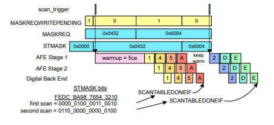

### Gain et correction de l'offset

L'IADC a intégré des capacités de correction de gain et de décalage. Chacun des deux groupes de configuration contient ses propres valeurs de correction stockées dans le registre IADC_SCALEx, permettant à l'IADC d'appliquer automatiquement la correction appropriée pour la configuration IADC utilisée.

La correction du gain est effectuée via une valeur à virgule fixe de 16 bits avec une plage de 0,75x à 1,2499x. Les 3 MSB de la valeur du gain ne sont pas directement inscriptibles. Le bit GAIN3MSB dans IADC_SCALEx est utilisé pour sélectionner entre 011 et 100 pour les 3 MSB, et les 13 bits inférieurs sont programmés directement dans IADC_SCALEx_GAIN13LSB. La remise à zéro de GAIN3MSB sélectionne les bits les plus significatifs du gain comme 011, représentant une plage de 0,75x à 0,9999x. Le réglage de GAIN3MSB sur 1 sélectionne les bits les plus significatifs du gain sur 100, ce qui représente une plage de 1,00x à 1,2499x.

La correction du décalage est contrôlée par le champ OFFSET dans IADC_SCALEx. Il est important de noter que la correction de décalage n'a pas de relation directe de 1 à 1 avec le LSB de la sortie IADC et dépend à la fois des paramètres d'OSR et de correction de gain. La plage de correction du décalage est de +/- 12,5 % de la pleine échelle. OFFSET est codé sous la forme d'un complément à 2, nombre de 18 bits, le LSB représentant 1/220 de la pleine échelle. Ainsi, le bit 8 de OFFSET s'aligne sur le bit 0 du mot de sortie IADC de 12 bits.

#### Utilisation des paramètres d'étalonnage de production

L'étalonnage IADC est effectué sur chaque appareil pendant le test de production de Silicon Labs et les paramètres d'étalonnage de production sont stockés dans la page flash DI. Les valeurs d'étalonnage de production sont utiles pour une grande variété de configurations IADC possibles, mais ne correspondent pas directement aux champs de correction de décalage et de gain dans les registres IADC_SCALEx. Le logiciel doit calculer les valeurs réelles de décalage et de correction de gain à partir des valeurs d'étalonnage d'usine.

#### Correction du gain

L'erreur de gain est mesurée lors du test de production avec différents paramètres de ANALOGGAIN et stockée dans les emplacements DEVINFO_IADC0GAIN0 et DEVINFO_IADC0GAIN1. Le champ GAINCANA1 est utilisé pour les paramètres ANALOGGAIN 0,5x et 1x, tandis que GAINCANA2, GAINCANA3 et GANCANA4 sont utilisés pour les paramètres ANALOGGAIN de 2x, 3x et 4x, respectivement.

Les valeurs GAINCANAn sont exprimées sous la forme du gain complet en virgule fixe de 16 bits et doivent être compressées avant d'écrire dans le registre IADC_SCALEx.

##### Correction du gain en mode NORMAL/HIGH SPEED

Lorsque l'IADC fonctionne en mode Normal/Haute vitesse, un filtre de 1er ordre est utilisé dans la décimation. La valeur nominale du gain dans ces modes pour tous les paramètres OSRHS est de 1,0, ou 0x8000, comme exprimé au format 16 bits à virgule fixe. L'erreur de gain IADC est conçue pour être minimale avec la correction de gain numérique réglée sur 1,0 (GAIN3MSB = 1 et GAIN13LSB = 0). Une erreur de gain plus stricte est obtenue en ajustant ces valeurs dans IADC_SCALEx. L'utilisation de ce mécanisme de correction de gain entraînera une légère augmentation du DNL du convertisseur, qui sera réduit par des paramètres OSR plus élevés.

Pour appliquer un gain calibré en usine :

1. Lisez le champ GAINCANAn approprié à partir des emplacements DEVINFO pour le ANALOGGAIN sélectionné.
2. Écrivez le MSB (bit 15) de GAINCANAn dans GAIN3MSB dans IADC_SCALEx.
3. Écrivez les 13 LSB (bits 12-0) de GAINCANAn dans GAIN13LSB dans IADC_SCALEx.

##### Correction du gain en mode High Accuracy

Lorsque l'IADC fonctionne en mode haute précision, un filtre de 2ème ordre est utilisé dans la décimation. La valeur nominale du gain du filtre dépend du réglage OSRHA. La valeur de gain stockée dans l'espace DEVINFO doit être ajustée avant de s'appliquer au registre IADC_SCALEx.

Pour appliquer un gain calibré en usine :

1. Lisez le champ GAINCANAn approprié à partir des emplacements DEVINFO pour le ANALOGGAIN sélectionné.
2. Multipliez la valeur par le facteur de correction de gain OSR (ha_gain) trouvé dans le Tableau 22.5 Correction de gain idéale de haute précision à la page 729.
3. Écrivez le MSB (bit 15) du résultat dans GAIN3MSB dans IADC_SCALEx.
4. Écrivez les 13 LSB (bits 12-0) du résultat dans GAIN13LSB dans IADC_SCALEx.

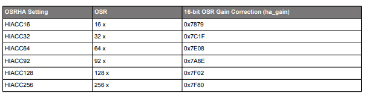

#### Correction de l'offset

Le décalage est affecté par les paramètres ANALOGGAIN et OSR sélectionnés dans IADC_CFGx, les valeurs GAIN3MSB et GAIN13LSB dans IADC_SCALEx et la référence de tension. Le décalage est calibré en production pour toute combinaison de possibilités, mais la valeur du registre OFFSET doit être calculée pour la situation donnée avant de pouvoir être utilisée efficacement.

### Calibration

L'étalonnage peut être effectué dans le système pour corriger les erreurs externes et fournir des mesures plus précises. La procédure générale d'étalonnage est la suivante :

1. Configurez l'ADC sur le mode souhaité, l'OSR, les paramètres de gain analogique, la source de référence, etc.
2. Forcez l'IADC à utiliser la sortie bipolaire pour la conversion : IADC_CFGx_TWOSCOMPL = FORCEBIPOLAR.
3.Réglez le décalage initial sur la valeur négative maximale (IADC_SCALEx_OFFSET = 0x20000) et le gain initial sur 1,0 (GAIN3MSB =
1, GAIN13LSB = 0x0000). Cela empêchera la saturation de la sortie lors de la mesure à pleine échelle.
4. Appliquer une contribution positive à grande échelle au CID
et effectuez une conversion (result_fullscale). Plusieurs conversions peuvent être effectuées et
moyennés ensemble pour réduire tout bruit au niveau du système.
5.Appliquez une entrée nulle à l'IADC et effectuez une conversion (result_zero). Plusieurs conversions peuvent être effectuées et moyennées ensemble pour réduire tout bruit au niveau du système.
6. Calculez le facteur de correction de gain : divisez la valeur attendue par la différence des valeurs mesurées (result_fullscale - result_zero). Notez que l'ajustement du décalage à l'étape 3 sera annulé par ce calcul.
7. Écrivez le facteur de correction de gain dans l'IADC à l'aide des champs GAIN3MSB et GAIN13LSB dans IADC_SCALEx.
8. Définissez IADC_SCALEx_OFFSET sur 0x00000 en préparation pour l'étalonnage du décalage.
9. Appliquez la tension zéro souhaitée à l'entrée IADC et effectuez une conversion (result_offset). Plusieurs conversions peuvent être effectuées et moyennées ensemble pour réduire tout bruit au niveau du système.
10. Multipliez result_offset pour convertir en une valeur de 20 bits (result_offset_20). Par exemple, un résultat de 12 bits doit être multiplié par 256.
11. Annulez result_offset_20 et écrivez la valeur dans IADC_SCALEx_OFFSET.

Notez que le champ IADC_SCALEx_OFFSET est 18
morceaux. Si le résultat est supérieur à (2^17 - 1) ou inférieur à (-2^17), le décalage est trop important pour être corrigé.

#### Output data FIFO

Les files d'attente simples et de balayage ont chacune une FIFO de données de huit mots. Les résultats des conversions sont écrits dans le FIFO de données de sortie associé à la file d'attente. Les résultats de la file d'attente unique sont écrits dans la FIFO unique et les résultats de la file d'attente d'analyse sont écrits dans la FIFO des données d'analyse. Les deux files d'attente sont identiques dans leur fonctionnement, mais indépendantes.

Les résultats de conversion sont lus à partir du FIFO unique à l'aide de IADC_SINGLEFIFODATA. La lecture de SINGLEFIFODATA fera apparaître le résultat le plus ancien du FIFO. Il est également possible de lire le mot de données valide le plus récent en utilisant IADC_SINGLEDATA. La lecture de SINGLEDATA ne génère pas de conversion du FIFO. De même, les résultats de l'analyse FIFO sont lus avec IADC_SCANFIFODATA, qui lit le résultat le plus ancien et affiche le FIFO. Le résultat de l'analyse le plus récent peut être lu à l'aide de IADC_SCANDATA.

Lorsque le FIFO unique contient des données valides, l'indicateur SINGLEFIFODV dans IADC_STATUS est défini sur 1. Lorsque le FIFO d'analyse contient des données valides, SCANFIFODV dans IADC_STATUS est défini sur 1. Ces bits d'état valides de données sont automatiquement effacés chaque fois que le FIFO associé est vide. Pour un état FIFO plus granulaire, le nombre de mots de données présents dans le FIFO est indiqué dans IADC_SINGLEFIFOSTAT (pour un FIFO unique) ou IADC_SCANFIFOSTAT (pour un FIFO de balayage).

Un filigrane de niveau de données programmable est également disponible pour les FIFO, permettant au matériel de déclencher des interruptions ou des opérations DMA lorsqu'un nombre spécifié de résultats de conversion est disponible. Le champ DVL du registre SINGLEFIFOCFG ou SCANFIFOCFG fixe le niveau du filigrane, entre 1 et 4 conversions. Si le nombre d'entrées valides dans le FIFO atteint ou dépasse le niveau défini dans DVL, l'indicateur SINGLEFIFODVLIF (pour un FIFO unique) ou SCANFIFODVLIF (pour un FIFO de balayage) dans le registre IADC_IF sera défini sur 1. S'il est activé, une interruption ou un DMA La demande sera déclenchée lorsque l'indicateur sera défini.
Par défaut, les requêtes DMA sont désactivées pour un fonctionnement en EM2 ou EM3. Cependant, les bits DMAWUFIFOSINGLE ou DMAWUFIFOSCAN
dans SINGLEFIFOCFG ou SCANFIFOCFG peut être utilisé pour permettre les opérations DMA dans ces modes à plus faible énergie.

Les indicateurs d’état de débordement et de sous-débordement sont également disponibles dans IADC_IF. Une condition de débordement se produit lorsqu’une conversion IADC est terminée, mais que le FIFO associé est déjà plein. En cas de débordement, le drapeau SINGLEFIFOOFIF ou SCANFIFOOFIF sera activé. La conversion la plus récente sera toujours disponible dans le registre SINGLEDATA ou SCANDATA, mais le FIFO ne sera pas mis à jour avec les nouvelles données. Une condition de dépassement inférieur se produit lorsque le logiciel ou le matériel tente de lire à partir d'une FIFO vide. En cas de dépassement insuffisant, le drapeau SINGLEFIFOUFIF ou SCANFIFOUFIF sera activé.

### Alignement des données et ID de channel

L'IADC propose des options d'alignement des données et la possibilité d'inclure un identifiant de canal avec les données de conversion. Pour la file d'attente unique, l'alignement et l'ID de canal sont configurés dans le registre IADC_SINGLEFIFOCFG. Pour la file d'attente d'analyse, l'alignement et l'ID de canal sont configurés dans le registre IADC_SCANFIFOCFG.

Le champ de bits ALIGNMENT spécifie la justification des données et le nombre de bits de données, comme indiqué dans la Figure 22.19 Alignement des données à la page 734. Par défaut, le convertisseur produira des données justifiées à droite de 12 bits, correspondant à ALIGNMENT = RIGHT12.

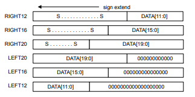

Le bit SHOWID contrôle si l'ID du canal de conversion est inclus dans le mot de données de sortie. Cette option est principalement utilisée avec le scan FIFO pour aider le logiciel à déterminer de quel canal provient chaque résultat de conversion. Si SHOWID est activé pour les conversions uniques,
l'ID sera toujours défini sur 0x20. La figure 22.20 Alignement des données avec ID à la page 734 montre le formatage des données de sortie, y compris l'ID, lorsque SHOWID = 1.

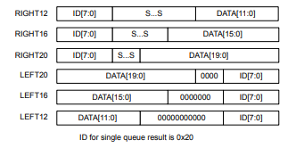

### Polarité de la sortie

La polarité de sortie de l'IADC est contrôlée par le champ TWOSCOMPL dans le registre IADC_CFGx. L'IADC prend en charge le formatage de sortie unipolaire et bipolaire indépendamment de la configuration d'entrée. Par défaut, le champ TWOSCOMPL est défini sur AUTO, ce qui signifie que les conversions asymétriques produiront une sortie unipolaire et que les conversions différentielles produiront une sortie bipolaire. La polarité peut être forcée en mode unipolaire ou bipolaire en réglant TWOSCOMPL sur FORCEUNIPOLAR ou FORCEBIPOLAR, respectivement.

Les échantillons unipolaires sont des entiers non signés représentant une pleine échelle de zéro à positive. Les échantillons bipolaires sont des entiers signés en complément à deux, représentant une pleine échelle négative à une pleine échelle positive. L'utilisation du mode unipolaire sur un signal d'entrée différentiel permet une plus grande plage dynamique lorsque le signal est positif, mais saturera à zéro lorsque le signal est négatif.

Remarque : Si la sortie bipolaire est utilisée avec une configuration d'entrée asymétrique, il est possible de voir des valeurs de sortie négatives lorsque l'entrée est
proche du sol. Cependant, la tension d'entrée est toujours limitée par la plage d'alimentation de l'appareil.

### Accumulation et moyenne numériques

L'IADC peut éventuellement accumuler et faire la moyenne de plusieurs résultats de conversion avant de publier un mot de sortie dans le FIFO. La moyenne numérique est contrôlée par le champ DIGAVG dans le registre IADC_CFGx. Il peut être configuré pour faire une moyenne de 1, 2, 4, 8 ou 16 échantillons. L'IADC collectera dos à dos le nombre d'échantillons spécifié par DIGAVG sur l'emplacement de canal sélectionné et produira un seul mot de sortie moyenné.

### Résolution de la sortie

La résolution de sortie utilisable de l'IADC est d'un minimum de 12 bits, lorsque le taux de suréchantillonnage est réglé sur 2 et qu'aucune moyenne numérique n'est utilisée (DIGAVG = AVG1). Un bit supplémentaire de résolution de sortie est produit pour chaque augmentation de puissance de 2 dans l'un ou l'autre de ces paramètres. En d’autres termes, la résolution de sortie de l’ADC peut être déterminée comme suit :

Résolution de sortie = 11 + log2 (OversamplingRatio × DigitalAveraging)

Le MSB est toujours aligné à gauche dans le champ DATA et le mot de sortie sera tronqué à 12, 16 ou 20 bits, comme illustré dans la Figure 22.19 Alignement des données à la page 734 et la Figure 22.20 Alignement des données avec ID à la page 734. en utilisant un alignement de 16 ou 20 bits avec un taux de suréchantillonnage inférieur et des paramètres de moyenne numérique, les LSB de la sortie peuvent contenir des effets résiduels du calcul du décalage et du gain. Ces effets résiduels ne représentent pas d’informations supplémentaires sur le signal d’entrée. Tous les LSB supplémentaires peuvent être masqués à 0 par logiciel.

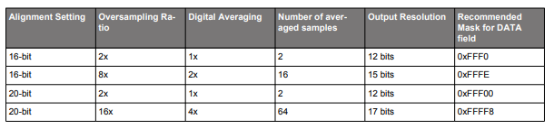

### Flusher les FIFOs

Chaque FIFO possède un bit de commande dans le registre IADC_CMD qui peut être utilisé pour déclencher un vidage FIFO. Les données FIFO peuvent être vidées indépendamment pour chaque file d'attente. Pour vider un FIFO :

1. L'IADC doit être activé avec l'horloge en marche.
2. Désactivez la file d'attente associée au FIFO à l'aide des bits SCANSTOP ou SINGLESTOP dans le registre IADC_CMD.
3. Assurez-vous que la file d'attente est désactivée en lisant l'indicateur associé dans le registre IADC_STATUS (SINGLEQEN ou SCANQEN).
4. Définissez le bit de commande pour vider le FIFO souhaité (SINGLEFIFOFLUSH ou SCANFIFOFLUSH) dans le registre IADC_CMD.
5. Attendez que le bit d'état correspondant (SINGLEFIFOFLUSHING ou SCANFIFOFLUSHING) dans IADC_STATUS passe au niveau bas.

### Windows Compare

L'IADC dispose d'une unité de comparaison de fenêtre qui peut déclencher des interruptions conditionnelles aux données de sortie du convertisseur. L'unité de comparaison de fenêtre comporte deux seuils : supérieur ou égal (ADGT) et inférieur ou égal (ADLT), qui sont programmables via le registre IADC_CMPTHR. Les seuils ADGT et ADLT utilisent toujours un format 16 bits justifié à gauche, quel que soit le format spécifié par le FIFO. Le résultat de la conversion 12 bits sera comparé aux 12 bits supérieurs du comparateur de fenêtre.

L'unité de comparaison de fenêtre est active sur la sortie ADC conversion par conversion et est partagée entre les deux FIFO. Il n'est pas possible de définir différents seuils de comparaison de fenêtres pour différents canaux ou pour chaque FIFO. Cependant, chaque canal spécifié dans l'IADC possède un champ de bits CMP pour permettre la comparaison de fenêtre sur les résultats de ce canal. Par exemple, il est possible d'appliquer uniquement la comparaison de fenêtre et l'interruption associée au canal de balayage n°3 en définissant le champ CMP dans IADC_SCAN3 sur 1. Lorsque le champ CMP associé à un canal est 0, le comparateur de fenêtre ne sera pas actif pour les résultats. de ce canal.

Le comparateur de fenêtre prend en charge le déclenchement conditionnel sur les résultats de sortie qui se trouvent à l'intérieur ou à l'extérieur d'une fenêtre spécifiée. Lorsque ADLT est supérieur ou égal à ADGT, le comparateur se déclenchera sur une condition "intérieure", ou lorsque DATA <= ADLT et DATA >= GT. Lorsque ADLT est inférieur à ADGT, le comparateur se déclenchera sur une condition "extérieure", ou lorsque DATA <= ADLT ou DATA >= GT.

La figure 22.21 Exemples de comparaison de fenêtres à la page 736 montre différentes configurations des valeurs ADLT et ADGT et les fenêtres résultantes. Lorsque le comparateur de fenêtre détecte que les conditions appropriées sont remplies (indiquées par la région ombrée sur la figure), il génère une interruption via l'indicateur SINGLECMPIF pour les conversions sur la file d'attente unique, ou via l'indicateur SCANCMPIF pour les conversions sur la file d'attente d'analyse.

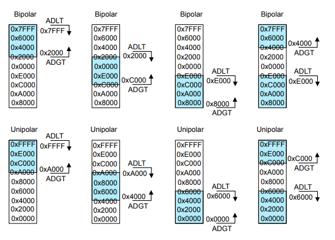

#### Les interruptions

Les interruptions sont activées dans le registre IADC_IEN, permettant de générer des interruptions sur plusieurs conditions IADC différentes. Chacun des indicateurs dans IADC_IF a un bit d'activation correspondant dans le registre IADC_IEN. Un bref aperçu des sources d'interruption disponibles est présenté dans la liste ci-dessous ; plus de détails peuvent être trouvés dans les sections pertinentes de ce chapitre.

- SINGLEFIFODVLIF - Le filigrane FIFO unique spécifié dans SINGLEFIFOCFG_DVL a été atteint ou dépassé.
- SCANFIFODVLIF - Le filigrane FIFO de numérisation spécifié dans SCANFIFOCFG_DVL a été atteint ou dépassé.
- SINGLECMPIF - Un résultat de conversion provenant de la file d'attente unique a déclenché le comparateur de fenêtre.
- SCANCMPIF - Un résultat de conversion provenant de la file d'attente d'analyse a déclenché le comparateur de fenêtre.
- SCANENTRYDONEIF - Une conversion de file d'attente d'analyse est terminée.
- SCANTABLEDONEIF - Une opération de file d'attente de balayage est terminée (tous les canaux spécifiés dans le masque de balayage ont été convertis une fois).
- POLARITYERRIF - Une erreur de sélection de polarité de canal s'est produite (deux canaux du multiplexeur PAIR ou deux canaux du
le multiplexeur ODD a été sélectionné pour les entrées positives et négatives).
- PORTALLOCERRIF - Une erreur d'allocation de port s'est produite (une broche non allouée à l'IADC dans les registres d'allocation de bus GPIO a été
demandé).
- SINGLEFIFOOFIF - Un seul dépassement FIFO s'est produit.
- SCANFIFOOFIF - Un dépassement de capacité FIFO d'analyse s'est produit.
- SINGLEFIFOUFIF - Un seul dépassement FIFO s'est produit.
- SCANFIFOUFIF - Un dépassement inférieur FIFO d'analyse s'est produit.
- EM23ABORTERRORIF - Le système est entré dans EM2 ou EM3 pendant que l'IADC était en train de convertir et d'utiliser une horloge non prise en charge dans EM2.
ou EM3.

Le matériel définit les indicateurs d'interruption dans IADC_IF, et les indicateurs restent définis (collants) jusqu'à ce qu'ils soient effacés par le logiciel. Les indicateurs d'interruption doivent être effacés avant de permettre à l'IADC de supprimer tout historique d'interruption précédent. L'effacement ou la définition des bits d'interruption peut être effectué en écrivant dans IADC_IF avec un masque défini ou effacé.

### LESENSE Interface

Le périphérique LESENSE peut être configuré pour déclencher les conversions IADC0 et utiliser les données de IADC0 pour évaluer l'état du capteur. Le matériel du scanner de canal est utilisé par LESENSE dans ce mode et le déclencheur IADC SCAN doit être réglé sur LESENSE. La file d'attente SCAN ne peut être utilisée que pour LESENSE lorsqu'elle est utilisée dans ce mode, mais la file d'attente SINGLE peut toujours être utilisée indépendamment. Lorsqu'un canal LESENSE est actif, le champ OFFSET dans le champ LESENSE_CHx_INTERACT est utilisé pour déterminer lequel des 16 canaux de scanner de l'ADC est échantillonné. OFFSET = 0 correspond à IADC_SCAN0, OFFSET = 1 correspond à IADC_SCAN1, et ainsi de suite.

L'échantillon IADC est déclenché lorsque le délai d'échantillonnage configuré dans LESENSE_CHx_TIMING_SAMPLEDLY a expiré. Les résultats de la conversion sont envoyés au FIFO de résultats LESENSE pour un traitement ultérieur par LESENSE et ne sont pas disponibles dans le FIFO SCAN.