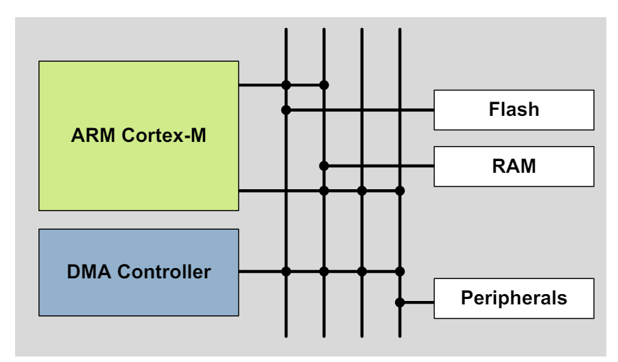
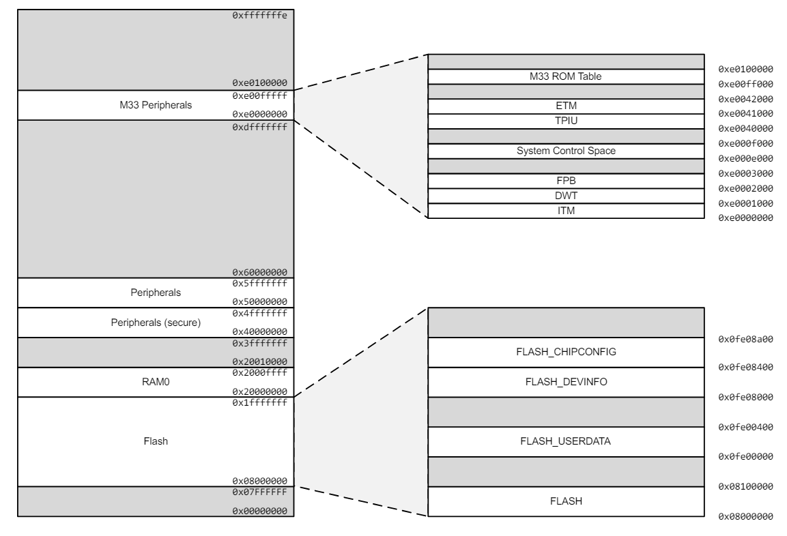
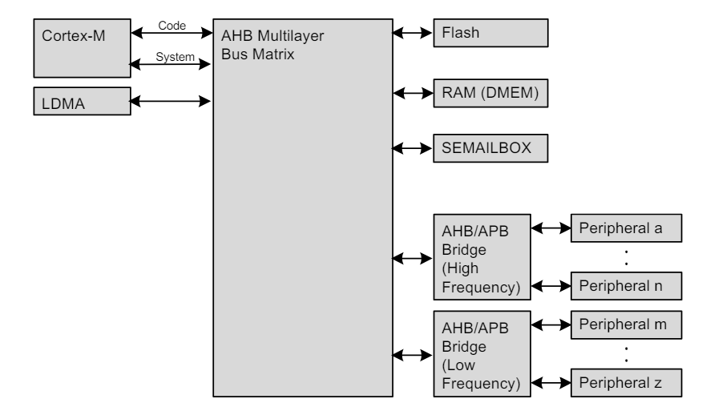

# Mémoires et Bus

Quoi ?

Un système de mémoire à faible latence comprenant du Flash et de la RAM à faible consommation d'énergie avec conservation des données qui rend les modes à faible consommation d'énergie attrayants.

Pourquoi ?

La conservation de la RAM réduit le besoin de stocker des données dans Flash et permet une utilisation fréquente des modes à très faible consommation d'énergie EM2 et EM3.

Comment ?

La mémoire Flash à faible consommation d'énergie et non volatile stocke les données du programme et des applications dans tous les modes d'énergie et peut facilement être reprogrammée dans le système. La RAM à faible fuite avec conservation des données dans EM0 à EM3 supprime la pénalité de temps de restauration des données, et le DMA garantit des transferts autonomes rapides avec un temps de réponse prévisible.

## Introduction

L'EFM32PG23 contient un ensemble de bus AMBA qui déplacent les données entre les périphériques, la mémoire et le processeur. Toutes les mémoires et interfaces de registre sont mappées en mémoire dans un espace d'adressage unifié.

## Description fonctionnelle

Les segments de mémoire interne du Cortex®-M33 sont mappés dans la carte de mémoire système, comme le montre la Figure 4.1 Espace d'adressage système avec liste des espaces de base et de code à la page 40.

Le flash pour la mémoire principale du programme (CODE) se trouve à l'adresse 0x08000000 dans la carte mémoire de l'EFM32PG23. La mémoire Flash contient également une zone USERDATA destinée au stockage de données définies par l'utilisateur, l'espace DEVINFO avec les caractéristiques de l'appareil et les informations d'identification, et CHIPCONFIG avec les informations de test de production interne et d'étalonnage.

La SRAM pour la mémoire de données principale (RAM) se trouve à l'adresse 0x20000000 dans la carte mémoire de l'EFM32PG23. Lors de l'exécution du code situé dans la RAM, le Cortex®-M33 utilise l'interface du bus système pour récupérer les instructions. Cela entraîne une réduction des performances car le Cortex®-M33 accède à la pile, aux autres données de la SRAM et aux périphériques à l'aide de l'interface du bus système.

## Bus Matrix

Une matrice de bus AMBA AHB multicouche connecte les interfaces de bus gestionnaire aux subordonnés AHB. La matrice de bus permet d'accéder simultanément à plusieurs subordonnés AHB. Une interface AMBA APB est utilisée pour les périphériques, accessibles via un pont AHBto-APB connecté à la matrice de bus AHB.

Le CPU dispose de deux gestionnaires de bus AHB (Code et Système) afin de pouvoir récupérer des instructions et des données en parallèle. Le gestionnaire de code est utilisé pour accéder à toute la mémoire inférieure à l'adresse 0x20000000 et les adresses d'accès au gestionnaire système 0x20000000 et supérieures.

## Arbitration

La matrice de bus utilise un algorithme d'arbitrage circulaire qui permet un débit élevé et une faible latence, tout en éliminant le manque d'accès simultanés au même bus subordonné. Le round-robin n'attribue pas de priorité fixe à chaque gestionnaire de bus. L'arbitre n'insère aucun état d'attente du bus pendant l'interaction de pointe. Cependant, un état d'attente est inséré pour les accès du gestionnaire se produisant après une période d'inactivité prolongée. Cet état d'attente permet d'augmenter l'efficacité énergétique pendant le temps d'inactivité du gestionnaire.

## Fautes sur le bus

Les accès au système depuis le noyau peuvent recevoir un défaut de bus dans les conditions suivantes :

- Le noyau tente d'accéder à une adresse qui n'est attribuée à aucun périphérique ou autre périphérique système. Ces défauts peuvent être activés ou désactivés en définissant le bit ADDRFAULTEN dans SYSCFG_CTRL
registre.

- Le noyau tente d'accéder à un registre périphérique VERROUILLÉ.

- Le noyau tente d'accéder à un périphérique ou à un périphérique système dont l'horloge est désactivée. Ce défaut peut être activé ou désactivé en définissant le bit ADDRFAULTEN dans le registre SYSCFG_CTRL.

- Le contrôleur de RAM système détecte une erreur ECC 2 bits. Ces défauts peuvent être activés ou désactivés en définissant le bit RAMECCERRFAULTEN dans le registre SYSCFG_CTRL.
- Les registres avec des exigences de synchronisation peuvent générer des défauts de bus en cas d'accès incorrect. Voir 4.2.4.4 Performances d'accès aux périphériques pour plus de détails sur les types d'accès aux registres. En particulier, les actions suivantes peuvent provoquer des défauts de bus :
  - Registre de configuration écrit alors que le périphérique est activé.
  - Registre de synchronisation écrit alors que le périphérique est désactivé.
  - Registre LfSync écrit alors qu'une écriture précédente est en attente.
  - Périphérique désactivé pendant qu'une écriture LfSync est en attente.
  - Registres périphériques écrits ou module réactivé alors que DÉSACTIVATION est activé.
  - Registres périphériques autres que les champs en écriture seule ou la lecture SWRST pendant que RESETTING est défini.
  - Registres périphériques autres que les champs en lecture seule (y compris SWRST) écrits pendant que RESETTING est activé.

En plus des bits de contrôle de défaut de bus spécifiques à une condition, l'interruption de défaut de bus elle-même peut être activée ou désactivée de la même manière que toutes les autres interruptions principales internes.

## Flash

Le Flash conserve les données dans n'importe quel état et stocke généralement le code de l'application et les données utilisateur spéciales. La mémoire Flash est généralement programmée via l'interface de débogage, mais peut également être effacée et écrite à partir d'un logiciel.
- Jusqu'à 512 Ko de mémoire
- Taille de page de 8 Ko (unité d'effacement minimale)
- Registres de verrouillage pour la protection de la mémoire
- Conservation des données dans n'importe quel état

## SRAM

La tâche principale de la mémoire SRAM est de stocker des applications. De plus, il est possible d'exécuter des instructions à partir de la SRAM et le DMA peut être configuré pour transférer des données entre la SRAM, la mémoire flash et les périphériques.

L'appareil contient jusqu'à quatre blocs de SRAM dans l'espace mémoire de données (DRAM). Pour des informations plus détaillées, voir 5. MSC - Memory System Controller.
- Jusqu'à 64 Ko de mémoire (RAM)
- Les blocs de RAM peuvent être mis hors tension lorsqu'ils ne sont pas utilisés
- Conservation des données de toute la mémoire ou des banques sélectionnées dans EM2 et EM3

## Map des périphériques

Les périphériques sont mappés dans le segment de mémoire périphérique, chacun avec une plage d'adresses de taille fixe indiquée dans la carte des périphériques 4.2.4.1.

Ce tableau montre la plage d'adresses pour chaque périphérique. De plus, il indique le mode d'énergie le plus faible dans lequel le périphérique est alimenté. Notez que EM3 est défini comme EM2 avec toutes les horloges désactivées. Par conséquent, tous les périphériques alimentés en EM2 sont également alimentés en EM3 mais peuvent ne pas fonctionner s'ils nécessitent une horloge en marche. Consultez les chapitres relatifs aux différents périphériques pour plus d'informations sur le fonctionnement à faible consommation.

## Comportement accès aux périphériques

Comportement d'accès périphérique sans mot

Lors de l'écriture dans des registres périphériques, tous les accès sont traités comme des accès 32 bits. Cela signifie que les écritures dans un registre doivent être suffisamment grandes pour couvrir tous les bits du registre, sinon tous les bits non couverts pourraient être corrompus lors du transfert de mots partiels. Ainsi, la pratique la plus sûre consiste à toujours effectuer des écritures 32 bits dans les registres périphériques.

Lors de la lecture, il n'y a généralement aucun problème avec les accès partiels aux mots, cependant, notez que toute action de lecture (par exemple, FIFO popping) sera déclenchée, que le champ binaire FIFO réel ait été ou non inclus dans la taille de transfert.

## Periphériques : Bit set et Bit Clear

L'EFM32PG23 prend en charge l'accès au jeu de bits, à l'effacement des bits et à la bascule de bits à la plupart des registres périphériques. La fonctionnalité de définition de bits et d'effacement de bits (également appelée Bit Access) permet de modifier les champs de bits sans qu'il soit nécessaire d'effectuer une lecture-modification-écriture. De plus, l'opération est contenue dans un seul accès au bus. Les registres d'accès aux bits et leurs adresses sont affichés dans la carte des registres pour chaque périphérique. Les périphériques sans registres _SET, _CLR ou _TGL dans la carte des registres ne prennent pas en charge ces fonctions.

Chaque registre doté de la fonctionnalité Bit Set aura un registre _SET. Chaque fois qu'un bit du registre SET est écrit à 1, le bit correspondant dans son registre cible est défini. Le registre SET est situé à TARGET + 0x1000 où TARGET est l'adresse du registre cible et porte le même nom que le registre cible avec '_SET' ajouté.

Chaque registre doté de la fonctionnalité Bit Clear aura un registre CLR. Chaque fois qu'un bit du registre CLR est écrit à 1, le bit correspondant dans son registre cible est effacé. Le registre CLR est situé à TARGET + 0x2000 où TARGET est l'adresse du registre cible et porte le même nom que le registre cible avec '_CLR' ajouté.

Chaque registre doté de la fonctionnalité Bit Toggle aura un registre TGL. Chaque fois qu'un bit du registre TGL est écrit à 1, le bit correspondant dans son registre cible est inversé. Le registre TGL est situé à TARGET + 0x3000 où TARGET est l'adresse du registre cible et porte le même nom que le registre cible avec '_TGL' ajouté.

Remarque : Il est possible de combiner les opérations d'effacement de bits et de définition de bits afin de modifier arbitrairement les champs du registre multi-bits sans affecter les autres champs du même registre. Dans ce cas, il faut veiller à ce que le champ ne comporte pas de valeurs intermédiaires pouvant conduire à un comportement erroné. Par exemple, si des opérations d'effacement de bits et de définition de bits sont utilisées pour modifier un champ de registre de réglage analogique de 0x2 à 0x4 en effaçant le bit 1 puis en réglant le bit 2, le champ prendrait une valeur de zéro pendant une courte période. Si le module analogique est actif à ce moment-là, cela pourrait entraîner un comportement indésirable.