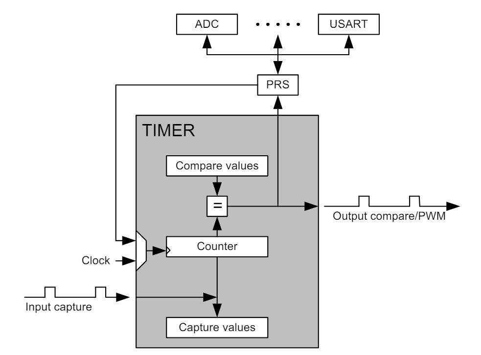
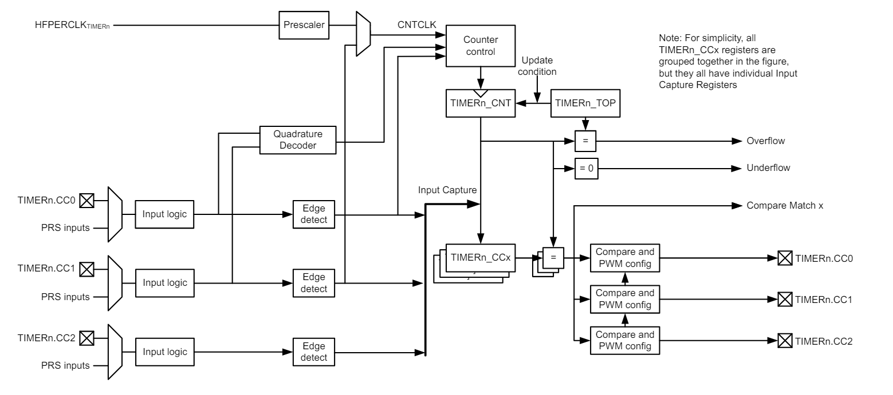
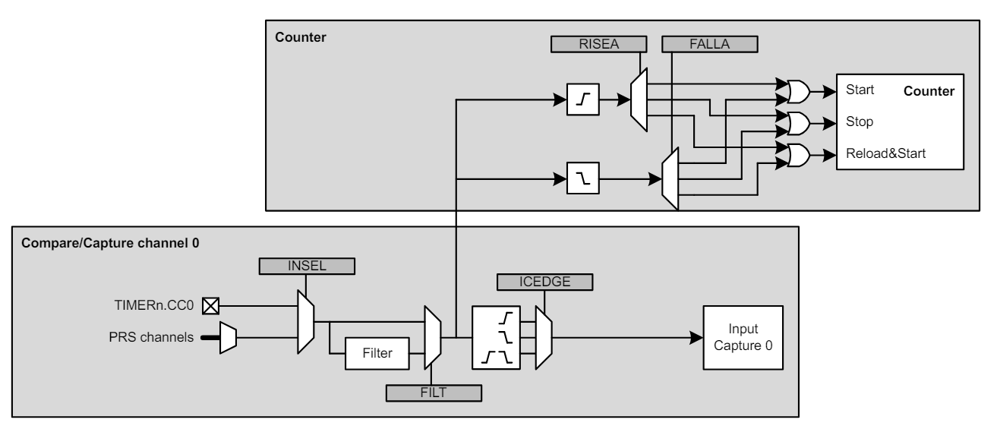

# TIMER

Quoi ?

Le TIMER (Timer/Counter) assure le suivi du timing et compte les événements, génère des formes d'onde de sortie et déclenche des actions chronométrées dans d'autres périphériques.

Pourquoi ?

La plupart des applications ont des activités qui doivent être chronométrées avec précision avec le moins d'intervention du processeur et de consommation d'énergie possible.

Comment ?

Le TIMER 16/32 bits peut être configuré pour fournir des formes d'onde PWM avec une insertion de temps mort en option (par exemple, contrôle du moteur) ou fonctionner comme un générateur de fréquence. La minuterie peut également compter les événements et contrôler d'autres périphériques via le PRS, ce qui décharge le processeur et réduit la consommation d'énergie.

## Introduction

Le TIMER à usage général dispose de 3 ou 4 canaux de comparaison/capture pour la capture d'entrée et la sortie de comparaison/modulation de largeur d'impulsion (PWM).

Le module TIMER peut avoir une largeur de 16 ou 32 bits. Certaines minuteries incluent également un module d'insertion de temps mort adapté aux applications de commande de moteur.

Reportez-vous à la fiche technique de l'appareil pour déterminer les capacités
 (capturer/comparer le nombre de canaux, la largeur et le DTI) de chaque instance de TIMER.

 ## Principe de fonctionnement

Un aperçu du module TIMER est présenté dans la Figure 18.1 Présentation du bloc TIMER à la page 475 et il se compose d'un compteur/décompteur 16/32 bits avec 3 canaux de comparaison/capture connectés aux broches TIMn_CC0, TIMn_CC1 et TIMn_CC2.

 

## Accès aux registres

L'interface du module de TIMER se compose de plusieurs types de registres. Les registres de type "RW CONFIG" ne doivent être écrits que lorsque le module est désactivé (`TIMERn_EN_EN = 0`). Les registres de type "W SYNC", "R SYNC" ou "RW SYNC" ne doivent être lus ou écrits que lorsque le module est activé (`TIMERn_EN_EN = 1`). Une séquence de configuration typique pour un module TIMER est la suivante :

1. Avec le TIMER désactivé (`TIMERn_EN_EN = 0`), programmez tous les registres CONFIG requis pour l'application.
2. Activez le TIMER en réglant EN dans TIMERn_EN sur 1.
3. Programmez tous les registres non-CONFIG requis pour l'application.
4. Le TIMER est alors prêt à être utilisé.

## Mode de comptage

Le TIMER se compose d'un compteur qui peut être configuré selon les modes suivants, à l'aide du champ MODE dans `TIMERn_CFG` :

• Up-count: le compteur compte jusqu'à ce qu'il atteigne la valeur dans `TIMERn_TOP`, où il est réinitialisé à 0 avant de compter à nouveau.

• Down-Count: le compteur démarre à la valeur de `TIMERn_TOP` et décompte. Lorsqu'il atteint 0, il est rechargé avec la valeur dans `TIMERn_TOP`.

• Up/Down Count : Le compteur démarre à 0 et compte. Lorsqu'il atteint la valeur dans `TIMERn_TOP`, il compte à rebours jusqu'à atteindre 0 et recommence à compter.

• Quadrature Decoder : deux canaux d'entrée dont l'un détermine le sens du comptage, tandis que l'autre broche déclenche un événement d'horloge. En plus des modes TIMER répertoriés ci-dessus, le TIMER prend également en charge un mode de comptage 2x. Dans ce mode, le compteur incrémente/décrémente de 2 à chaque front d'horloge. Le mode de comptage 2x peut être utilisé pour doubler la fréquence PWM lorsque le canal de comparaison/capture est mis en mode PWM. Le mode de comptage 2x est activé en définissant le champ de bits X2CNT dans le registre `TIMERn_CTRL`. La valeur du compteur peut être lue ou écrite par logiciel à chaque fois que le module est activé en accédant au champ CNT dans TIMERn_CNT.

## Evénements

Le compteur principal peut générer des événements de débordement et de sous-débordement pendant le fonctionnement.

Le débordement (`TIMERn_IF_OF`) est défini lorsque la valeur du compteur passe de TIMERn_TOP à la valeur suivante lors du comptage. En mode comptage et en mode décodeur en quadrature, la valeur suivante est 0. En mode comptage/décomptage, la valeur suivante est TIMERn_TOP-1.

Le dépassement inférieur (`TIMERn_IF_UF`) est défini lorsque la valeur du compteur passe de 0 à la valeur suivante lors du compte à rebours. En mode décompte et en mode décodeur en quadrature, la valeur suivante est TIMERn_TOP. En mode comptage/décomptage, la valeur suivante est 1.

Un événement de mise à jour se produit en cas de dépassement en mode comptage et en cas de dépassement insuffisant en mode décompte ou décompte. De plus, un événement de mise à jour se produit également en cas de débordement et de sous-dépassement dans le décodeur en quadrature. Cet événement est utilisé pour chronométrer les mises à jour des valeurs mises en mémoire tampon.

## Opérations

La figure 18.2 Contrôle de minuterie/compteur matériel TIMER à la page 477 illustre le contrôle de minuterie/compteur matériel. Le logiciel peut démarrer ou arrêter le compteur en définissant les bits START ou STOP dans TIMERn_CMD. La valeur du compteur (CNT dans TIMERn_CNT) peut toujours être écrite par logiciel sur n'importe quelle valeur 16/32 bits.

Il est également possible de contrôler le compteur via une broche externe ou une entrée PRS. Cela se fait via la logique d'entrée du canal de comparaison/capture 0. Le temporisateur/compteur permet d'effectuer des actions individuelles (démarrage, arrêt, rechargement) pour les fronts d'entrée montants et descendants.

Ceci est configuré dans les champs RISEA et FALLA dans TIMERn_CTRL. La valeur de rechargement est 0 en mode comptage et décomptage et TOP en mode décomptage.

Le bit RUNNING dans TIMERn_STATUS indique si le temporisateur est en cours d'exécution ou non. Si le bit SYNC dans TIMERn_CFG est activé, la minuterie est démarrée/arrêtée/rechargée (broche externe ou PRS) lorsque l'une des autres minuteries est démarrée/arrêtée/rechargée.

Le bit DIR dans TIMERn_STATUS indique le sens de comptage du temporisateur à un instant donné. La valeur du compteur peut être lue ou écrite par logiciel via le champ CNT dans TIMERn_CNT. En mode comptage/décomptage, le sens de comptage sera réglé vers le haut si la valeur CNT est écrite par logiciel.

